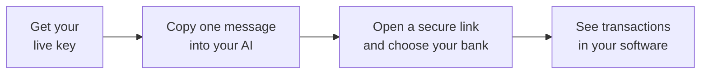

Get your LedgerSync key, copy one message into Claude or ChatGPT, and let it build your bank connection. You can connect your own bank or send a secure link to a client.



## 1. Get your live key

Do these steps in order. If you have already completed a step, move to the next one. Click or tap any screenshot to enlarge it.

<Steps>
  <Step title="Sign up">
    Create an account at [portal.ledgersyncappv2.com](https://portal.ledgersyncappv2.com) using your work email address. Complete the account application when prompted.
  </Step>
  <Step title="Wait for account approval">
    Our team reviews your application. Watch your email for approval or a request for more information. If a few days pass with no word, email [support@ledgersync.com](mailto:support@ledgersync.com).
  </Step>
  <Step title="Request access to real banks">
    Once approved, sign in to the portal and open **Build → Overview** in the left menu. Select **Live** at the top right, then click **Request access**. If you already started, click **Continue application**.

    <Frame caption="Open Overview under Build, select Live at the top right, then click Request access.">
      
    </Frame>

    Follow the application steps and add a payment method when prompted. Finish this step so your live application can be reviewed.
  </Step>
  <Step title="Wait for live approval">
    Our team reviews your request for real bank connections. Watch your email and provide any extra information requested.
  </Step>
  <Step title="Create your live key">
    Check that **Live** is still selected at the top right. Open **Build → API keys** in the left menu.

    <Frame caption="In the portal's left menu, find Build and click API keys.">
      
    </Frame>

    Under **Create new key**, set **Environment** to **Live**, then click **Create key**.

    <Frame caption="On the API keys page, set Environment to Live under Create new key, then click Create key.">
      
    </Frame>

    Copy your key and keep it somewhere private, such as your password manager. It is shown **only once**. If you lose it, create a new one.
  </Step>
</Steps>

## 2. Connect your bank with AI

Open a new chat with Claude, ChatGPT, or the AI tool you use to build your app.

<Steps>
  <Step title="Copy this message">
    Open the box below and use its copy button. Paste it into your new chat, but do not press send yet. You do not need to read the text inside the box; it tells the AI what to build.

<Accordion title="Open the message to copy" icon="clipboard" defaultOpen={false}>

```markdown connect-my-bank.md
# LedgerSync API: build my live bank integration

Follow this document exactly. Do not invent endpoints, fields, query
parameters, or error codes.

I am not a programmer. Assume I cannot answer a technical question
without help.

If you need something only I can give you, ask me for one thing at a
time, in plain words, and explain what it is and where I would find it.
If I say I do not know, do not stop and do not guess: tell me the
options, pick a sensible default, and carry on.

You need three things from me. Ask for them one at a time:

- My live API key, starting with `sk_live_`. Help me put it directly in
  my project's secret or environment settings if your tool supports that.
- Where my app runs, so you know where to put the code. If I do not
  know, ask me who looks after my website and tell me to forward your
  answer to them.
- A public web address for receiving updates. If I do not have one, do
  not stall: set one up yourself if you can, or explain in one sentence
  what it is and help me get a permanent HTTPS address for the app. Never
  just ask me for a URL and wait. `localhost` will never work.

Keep my live key in server-side secret or environment settings. Never
print it back to me, log it, or write it into code you show me. Keep
secret files out of version control. Never ask for my bank password.

If you can fetch a web page yourself and need more detail than this
document carries, read https://docs.ledgersyncappv2.com/llms-full.txt

## What this API does

LedgerSync links my users' bank accounts and returns their accounts,
balances, transactions and statements through one REST API. Bank
passwords are typed into a LedgerSync-hosted page and never reach my
servers.

## Base URL and auth

Use https://api.ledgersyncappv2.com/v3 from the start, with my live key.
Send `Authorization: Bearer <my key>` on every request. JSON over HTTPS.
Use a plain HTTP client for this integration.

Every response has an `X-LS-Trace-Id` header. Log it.

## How the objects fit together

Client (`cli_` + 24 hex) is my record of one end user.
  -> Connection (`con_<SOURCE>_<number>`, e.g. `con_FINICITY_41294`),
     one per linked bank.
    -> Account (`acc_<SOURCE>_<number>`)
      -> Transaction (`txn_<SOURCE>_<number>`) and Statement
         (`stmt_<SOURCE>_<number>`)

SOURCE is FINICITY, MX, FDE or PDF, and LedgerSync picks it, never me.

## Set up live updates first

Before anyone opens a bank connection link, deploy the HTTPS receiver
with the signature checks below, then create the live subscription.

To receive webhooks, create a subscription once with
`POST /webhooks/subscriptions` with `{"url": "...", "event_types": ["*"]}`.
The response carries a `signing_secret` ONCE and no endpoint returns it
later. Save it directly in the deployed receiver's server-side secret or
environment settings. If you cannot configure those settings, tell me
how to save the secret from the response there without pasting it into
chat. Never repeat it in your reply, put it in example code, or log it.
Restart or redeploy the receiver if needed so it loads the new secret.
Confirm the deployed receiver has signature verification enabled before
anyone opens a bank link. A local `.env` file alone does not configure a
hosted app.

If the app needs to send the user back to it after bank sign-in, configure
its HTTPS return address. First `GET /settings/redirect-urls`, then add
the address to `allowed_redirect_urls` without removing existing entries.
`POST /settings/redirect-urls` with `{"allowed_redirect_urls": ["..."]}`
sets the complete list. Pass the address as `redirect_url` when creating
the connect session. If no return address is needed, omit that field.

## Build this flow

1. `POST /clients` with `{"name": "..."}`. Store the returned `cli_...` id.
2. `POST /clients/{client_id}/connect-session` with `{}` (or with the
   optional `redirect_url` configured above).
   Returns `{"url": "...", "expires_at": "..."}`.
3. Send that url to my end user. They open it, find their own bank, sign
   in, and choose accounts. I build no bank picker and never see their
   password.
4. Wait for the `connection.active` webhook. Read `data.connection.id`
   from it. That is the real connection id. Store it against my user.
5. `GET /accounts?client_id=cli_...&connection_id=con_FINICITY_41294`
6. `GET /accounts/{account_id}/transactions?client_id=cli_...&from=2026-01-01`

## Reading data

`GET /accounts?client_id=...` and optionally `&connection_id=...`
`GET /accounts/{account_id}/transactions?client_id=...&from=YYYY-MM-DD&to=YYYY-MM-DD`
   `from` includes that day, `to` excludes it. Newest first. Pending rows
   are always included, so branch on the `pending` field.
`GET /accounts/{account_id}/statements?client_id=...`
`GET /statements/{statement_id}/download?client_id=...` returns PDF bytes.

`client_id` is REQUIRED on every one of those. Leaving it off is a 400.

Transaction fields, and this is the complete list: `id`, `account_id`,
`external_id`, `amount`, `iso_currency_code`, `date`, `description`,
`merchant_name`, `category`, `pending`. `amount` is negative for money
out and positive for money in.

Account `type` is checking, savings, credit_card, loan, investment or
other. `current_balance` is from the account holder's point of view, so a
credit card with a balance owed comes back negative.

Lists page with `?cursor=...&limit=...` and return
`{"data": [...], "next_cursor": "...", "has_more": true}`. Keep passing
`next_cursor` back until `has_more` is false. A cursor only works for the
exact query that produced it.

Errors look like this. Branch on `error.code` and nothing else:

    {"error": {"code": "not_found", "message": "...", "type": "not_found",
               "category": "RESOURCE_NOT_FOUND", "trace_id": "..."}}

On a 429, honor the `Retry-After` header and back off.

## Verifying webhooks

Check every delivery before trusting it:

    signed = X-LS-Webhook-Timestamp + "." + the raw request body
    expected = hex(HMAC_SHA256(key = signing_secret, message = signed))
    compare expected with the X-LS-Webhook-Signature header, constant-time

The key is the whole `whsec_...` string as UTF-8. Do not decode it.
Capture the raw body bytes before any JSON parsing touches them. Reject
anything whose timestamp is more than 5 minutes old.

Reply 2xx within about 10 seconds and queue anything slower: we drop the
connection after that and treat it as a failure. We retry for 24 hours,
so the same event can arrive twice. Ignore duplicates by `event_id`.

## Rules that will break my integration if you get them wrong

1. Only ever store a connection id shaped `con_<SOURCE>_<number>`. A
   `con_` followed by a plain uuid is a temporary placeholder and returns
   400 everywhere. The real id comes from the `connection.active`
   webhook, or from `GET /clients/{client_id}/connections`. Re-checking
   the operation never turns the placeholder into the real one.
2. `client_id` goes on every accounts, transactions and statements read.
3. Branch on `error.code`. Never on the HTTP status or the message text.
4. Sign `timestamp + "." + body`, never the body on its own.
5. Never automatically retry a failed POST. It creates a duplicate.
6. `external_id` and `metadata` on a Client come back empty on every
   read, so never build a lookup on them. Use the `cli_` id.
7. A statement `download_url` is a partial address. Join it to the API
   host, not to the `/v3` URL, and send my key with it.
8. The first webhook for a new connection is
   `connection.requires_action`. There is no `connection.initiated`.
9. There is no event for a newly opened account. Re-read `GET /accounts`
   and compare ids.
10. Never put my key in anything that runs in a browser or a phone app.

## Only if I ask you for my own bank picker

`GET /institutions?q=chase` finds an `ins_...` id, then
`POST /clients/{client_id}/connections` with `{"institution_id": "..."}`
returns a `202`. Read `GET /operations/{operation_id}` and open
`result.connection.action.widget_url` for the user. The real connection
id still only arrives on the webhook, exactly as in rule 1.

## Finish with a real bank connection

Give me a way to create a secure bank link for each client. Tell me where
to click in my app, then have me open a link and connect my own bank.
Show me where the returned accounts and transactions appear in my app.
If something fails, check your work and explain the next action in plain
words. Do not create duplicate clients or subscriptions when resuming
an existing integration; inspect its saved configuration first.
```

</Accordion>
  </Step>
  <Step title="Say what you want">
    Add this sentence to the end of the same message. Fill in the blank with the name of your app or where you want to see the transactions:

    *"I want my clients' bank transactions to show up in ______. Give me a way to create a bank link for each client myself."*

    Now press send.
  </Step>
  <Step title="Answer the AI's questions">
    <p style={{ fontSize: "1.35rem", fontWeight: 700, textDecoration: "underline" }}>KEEP USING THIS SAME CHAT</p>

    Keep all your replies here so the AI remembers your setup. It will ask for one thing at a time and explain where to find it. If you do not know an answer, say so.

    When it asks for your key, follow its instructions for saving it privately in your app. Never share your bank password in the chat.
  </Step>
  <Step title="Put the connection into your app">
    If your AI tool can install the code, let it finish and show you where to create a bank link.

    If someone else looks after your software, ask the AI: *"Write a short message I can forward to the person who looks after my software, explaining what to install."* Send them that message and a link to this page. Continue when they tell you it is ready.
  </Step>
  <Step title="Connect a bank and check it worked">
    Ask the AI where to create your bank connection link. Open the link, type your bank's name, and select it from the results.

    <Frame caption="Open the secure bank link from your app to reach this screen. Type your bank's name and choose it from the results. Chase is an example.">
      
    </Frame>

    Follow the bank's sign-in steps and choose the accounts you want to connect. Enter your bank password only in the bank connection window.

    Return to your app. Your connected accounts and transactions should appear there once the bank finishes sending them. Ask the AI to show you where to look.

    For a client's bank, send the link to that client so they can sign in themselves. You never need their bank password.

    Nothing came back? Go to [If you need help](#3-if-you-need-help).
  </Step>
</Steps>

## 3. If you need help

<p style={{ fontSize: "1.35rem", fontWeight: 700, textDecoration: "underline" }}>KEEP USING THIS SAME CHAT</p>

Describe what happened and paste the message below into the chat you used above. Let the AI check its work.

If that conversation is gone, start a new one. Paste the setup message from [section 2](#2-connect-your-bank-with-ai), explain that your app is already built, and ask it to inspect the existing setup before changing anything. Then paste the message below.

```markdown fix-my-connection.md
Check your own code against this list, one line at a time, and fix
anything that does not match.

- The API host is https://api.ledgersyncappv2.com/v3, with my live key
  stored only on the server. Never print the key or signing secret.
- The live update receiver is reachable over HTTPS and its subscription
  points to that address.
- Every connection id you saved looks like con_SOURCE_NUMBER, never con_
  followed by a plain uuid.
- client_id is on every accounts, transactions and statements request.
- You branch on error.code, not on the HTTP status or the message text.
- The webhook signature is built from timestamp + "." + the raw body,
  not the body on its own, and you reject timestamps over 5 minutes old.
- You never automatically retry a failed POST.
- download_url is joined to the API host, not the /v3 URL, and sent with
  my key.
- Nothing looks up a Client by external_id or metadata, because both come
  back empty. It uses the cli_ id.

Tell me in plain words what you changed.
```

Still stuck? Email [support@ledgersync.com](mailto:support@ledgersync.com) with what you were doing and we will help. Do not include your key or bank password.

---

Building this by hand instead? The [Quickstart](/guides/quickstart) covers the developer steps.
