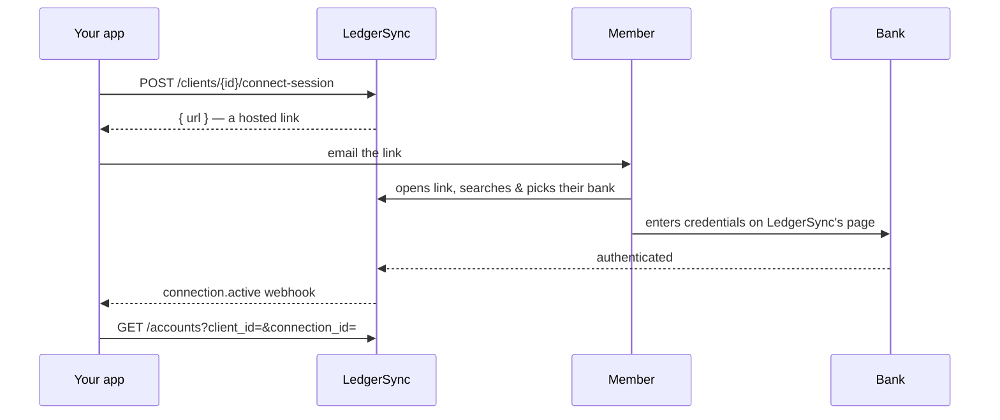
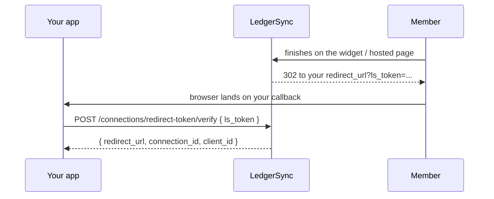

There are two ways to get a user's bank connected. Both finish with the same
`connection.active` webhook and the same data behind it. Choose based on how
much UI you want to own.

<CardGroup cols={2}>
  <Card title="Hosted link" icon="wand-magic-sparkles">
    We host everything: bank search, login, MFA. You create a link and send it.
    **No `institution_id` needed up front.**
  </Card>
  <Card title="Bring your own picker" icon="hand-pointer">
    You render the bank search from `GET /institutions`, then start the
    connection with the chosen `institution_id`.
  </Card>
</CardGroup>

## The hosted flow

You create a **connect session** for a client and get back a URL. Email it to
your member. They open it, find their bank, log in on our page, and you get a
webhook the moment it's live.



<Info>
  Bank credentials are entered **only** on the LedgerSync-hosted page. They
  never touch your servers, and never come through the API as raw values.
</Info>

## Three calls, start to finish

<Steps>
  <Step title="Create the member as a Client">
    A Client is just your record of "this is Alice."

    ```bash
    curl https://api-sandbox.ledgersyncappv2.com/v3/clients \
      -H "Authorization: Bearer sk_test_..." \
      -H "Content-Type: application/json" \
      -d '{"email":"alice@example.com","name":"Alice"}'
    ```
  </Step>

  <Step title="Create a connect session, get the link">
    ```bash
    curl -X POST \
      https://api-sandbox.ledgersyncappv2.com/v3/clients/cli_123/connect-session \
      -H "Authorization: Bearer sk_test_..."
    ```

    ```json Response
    {
      "url": "https://api-sandbox.ledgersyncappv2.com/v3/connect-session?token=...",
      "expires_at": "2026-07-10T12:00:00Z"
    }
    ```

    Email `url` to your member. That is the only link they need.
  </Step>

  <Step title="Receive connection.active">
    Register a webhook once, and we tell you the instant the connection is live.

    ```json Webhook
    {
      "type": "connection.active",
      "data": {
        "connection": {
          "id": "con_FINICITY_41294",
          "client_id": "cli_123",
          "source": "FINICITY",
          "status": "active"
        }
      }
    }
    ```

    Now read accounts, transactions, and statements for `con_FINICITY_41294`.
  </Step>
</Steps>

<Tip>
  Need to kill a link you already emailed? `DELETE /clients/{id}/connect-session/{sid}`
  invalidates it immediately.
</Tip>

## Prefer to build your own picker?

If you already have onboarding UI, skip the hosted page. Call
`GET /institutions?q=chase` to render the bank search inside your app, then
`POST /clients/{id}/connections` with the chosen `institution_id`. You still get
the same widget hand-off for credentials and the same `connection.active`
webhook, you just own the search box.

## Redirect flow

When a member finishes on the aggregator widget (FINICITY / MX), the browser
needs somewhere to land back in *your* app. Pass a `redirect_url` when you start
the connection and we bounce the member back to it with a short-lived
`ls_token`. Exchange that token server-side for the canonical connection id.



<Steps>
  <Step title="Register your callback URLs (once per environment)">
    Allowlist every URL you'll redirect to. The match is **exact** — scheme,
    host, port, and path must line up with what your app actually uses — and
    URLs are **https-only** and **per-environment** (a sandbox URL does not
    carry over to live). Each `POST` overwrites the full set.

    ```bash
    curl -X POST \
      https://api-sandbox.ledgersyncappv2.com/v3/settings/redirect-urls \
      -H "Authorization: Bearer sk_test_..." \
      -H "Content-Type: application/json" \
      -d '{"allowed_redirect_urls":["https://app.acme.com/ledgersync/callback"]}'
    ```

    ```json Response
    {
      "environment": "sandbox",
      "allowed_redirect_urls": ["https://app.acme.com/ledgersync/callback"]
    }
    ```
  </Step>

  <Step title="Pass redirect_url when you start the connection">
    Include `redirect_url` in the initiate body. It must exactly match an
    allowlisted entry or the call is rejected with `400 invalid_request`.

    ```bash
    curl -X POST \
      https://api-sandbox.ledgersyncappv2.com/v3/clients/cli_123/connections \
      -H "Authorization: Bearer sk_test_..." \
      -H "Content-Type: application/json" \
      -d '{"institution_id":"ins_01HZX9CHASE","redirect_url":"https://app.acme.com/ledgersync/callback"}'
    ```
  </Step>

  <Step title="Member lands back on your callback with an ls_token">
    After the widget completes, the browser is redirected to your
    `redirect_url` with an `ls_token` query parameter:

    ```
    https://app.acme.com/ledgersync/callback?ls_token=eyJhbGciOiJIUzI1NiJ9...
    ```
  </Step>

  <Step title="Exchange the token for the connection id">
    Your callback POSTs the token back to verify it and recover the connection.
    No API key is required on this call — the token's signature is the trust
    boundary.

    ```bash
    curl -X POST \
      https://api-sandbox.ledgersyncappv2.com/v3/connections/redirect-token/verify \
      -H "Content-Type: application/json" \
      -d '{"ls_token":"eyJhbGciOiJIUzI1NiJ9..."}'
    ```

    ```json Response
    {
      "redirect_url": "https://app.acme.com/ledgersync/callback",
      "connection_id": "con_FINICITY_41294",
      "client_id": "cli_123"
    }
    ```

    `connection_id` is the canonical `con_SOURCE_id` you use everywhere else
    (accounts, transactions, statements).
  </Step>
</Steps>

<Warning>
  `ls_token` is a **single-use, signed** token with a short expiry. Verify it
  **once, server-side** — a second `verify` for the same token returns
  `400 invalid_request`. Treat landing on your callback as a UI hand-off only;
  the `connection.active` webhook remains the source of truth that data is
  ready.
</Warning>

<Info>
  The redirect handshake is a browser convenience, not a substitute for
  webhooks. If a member closes the tab before the redirect fires, you still get
  `connection.active` — reconcile on the webhook, not on the callback landing.
</Info>

## Embedding

However you launch the connect flow, the hand-off is the same: you open a
LedgerSync-hosted URL, the member enters credentials only on our page, and you
find out it worked. What differs is *how* you open that URL.

### Redirect or mobile webview (recommended)

The default, and the only mode you need for the hosted `connect-session` flow:
open the URL as a full-page redirect (web) or in a system/webview (mobile).
Don't try to frame it.

When you set a `redirect_url`, the member lands back on it after a successful
connect with a single-use `ls_token` appended:

```
https://yourapp.com/return?ls_token=eyJhbGci...
```

Verify it server-side with `POST /v3/connections/redirect-token/verify` to read
the resulting `connection_id`.

<Warning>
  `ls_token` arrives **only** on your `redirect_url` query string — never through
  `postMessage`. Treat it as a one-time credential: verify it once, server-side,
  then discard it.
</Warning>

### Iframing the MX wrapper page

The MX Connect wrapper page (the `widget_url` returned for MX connections) is the
**one** hosted page you may iframe. On success it notifies the parent window:

```js
window.parent.postMessage(
  { ls: true, type: "ls/mx/memberConnected", connection_id: "con_MX_..." },
  "*"
);
```

To receive it, verify the origin and constrain your own page's CSP to our host:

```js
window.addEventListener("message", (event) => {
  if (event.origin !== "https://api.ledgersyncappv2.com") return; // ALWAYS check
  if (!event.data || event.data.ls !== true) return;
  if (event.data.type === "ls/mx/memberConnected") {
    // event.data.connection_id is live — now fetch its data
  }
});
```

```
Content-Security-Policy: frame-src https://api.ledgersyncappv2.com
```

<Info>
  In sandbox the wrapper is served from `https://api-sandbox.ledgersyncappv2.com`
  — use that host for both the `event.origin` check and your `frame-src`.
</Info>

<Warning>
  The `postMessage` is a **completion signal only** — it carries `connection_id`,
  never `ls_token`. It is posted with a `"*"` target origin, so the origin check
  in your listener is mandatory. If you set a `redirect_url`, the wrapper also
  redirects its own window (never `window.top`) with `ls_token`, exactly like the
  redirect flow above; the `postMessage` and the redirect are not mutually
  exclusive.
</Warning>

### What you cannot iframe

| Page | Iframe? | Why |
| --- | --- | --- |
| MX Connect wrapper (`widget_url`) | Yes | Passive; posts a completion signal, navigates its own window |
| Hosted pick-and-connect (`/v3/connect-session`) | **No** | Served with `X-Frame-Options: DENY` and CSP `frame-ancestors 'none'` — it's a credential-adjacent action surface |
| Finicity Connect (`widget_url`) | Yes | Same passive redirect contract as the MX wrapper |

For the hosted `connect-session` page, use a redirect or open it in a new tab —
framing it will be blocked by the browser.
