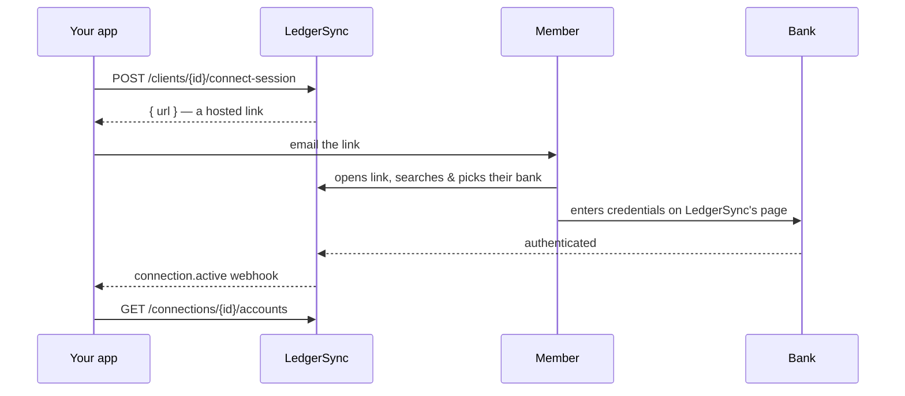

There are two ways to get a user's bank connected. Both finish with the same
`connection.active` webhook and the same data behind it. Choose based on how
much UI you want to own.

<CardGroup cols={2}>
  <Card title="Hosted link" icon="wand-magic-sparkles">
    We host everything: bank search, login, MFA. You create a link and send it.
    **No `institution_id` needed up front.**
  </Card>
  <Card title="Bring your own picker" icon="hand-pointer">
    You render the bank search from `GET /institutions`, then start the
    connection with the chosen `institution_id`.
  </Card>
</CardGroup>

## The hosted flow

You create a **connect session** for a client and get back a URL. Email it to
your member. They open it, find their bank, log in on our page, and you get a
webhook the moment it's live.



<Info>
  Bank credentials are entered **only** on the LedgerSync-hosted page. They
  never touch your servers, and never come through the API as raw values.
</Info>

## Three calls, start to finish

<Steps>
  <Step title="Create the member as a Client">
    A Client is just your record of "this is Alice."

    ```bash
    curl https://api-sandbox.ledgersyncappv2.com/v3/clients \
      -H "Authorization: Bearer sk_test_..." \
      -H "Content-Type: application/json" \
      -d '{"email":"alice@example.com","name":"Alice"}'
    ```
  </Step>

  <Step title="Create a connect session, get the link">
    ```bash
    curl -X POST \
      https://api-sandbox.ledgersyncappv2.com/v3/clients/cli_123/connect-session \
      -H "Authorization: Bearer sk_test_..."
    ```

    ```json Response
    {
      "url": "https://api-sandbox.ledgersyncappv2.com/v3/connect-session?token=...",
      "expires_at": "2026-07-10T12:00:00Z"
    }
    ```

    Email `url` to your member. That is the only link they need.
  </Step>

  <Step title="Receive connection.active">
    Register a webhook once, and we tell you the instant the connection is live.

    ```json Webhook
    {
      "type": "connection.active",
      "data": {
        "connection": {
          "id": "con_FINICITY_41294",
          "client_id": "cli_123",
          "status": "active"
        }
      }
    }
    ```

    Now read accounts, transactions, and statements for `con_FINICITY_41294`.
  </Step>
</Steps>

<Tip>
  Need to kill a link you already emailed? `DELETE /clients/{id}/connect-session/{sid}`
  invalidates it immediately.
</Tip>

## Prefer to build your own picker?

If you already have onboarding UI, skip the hosted page. Call
`GET /institutions?q=chase` to render the bank search inside your app, then
`POST /clients/{id}/connections` with the chosen `institution_id`. You still get
the same widget hand-off for credentials and the same `connection.active`
webhook, you just own the search box.
