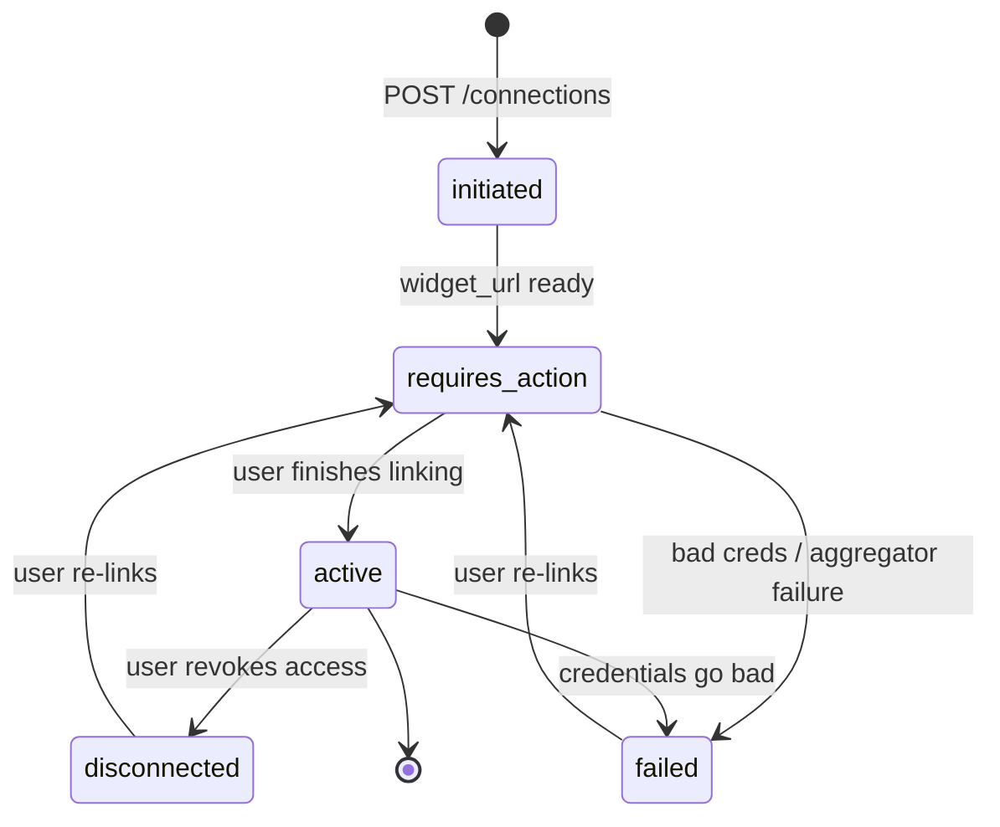

A **Connection** is one linked bank for one Client. It has a short, predictable lifecycle: you initiate it, the user finishes linking in a widget, and then data flows. This page walks the whole path, explains each status, and tells you what to do when a connection needs attention.

<Info>
Connections live under a Client: **Client → Connection → Account → Transaction / Statement**. One Client can own many Connections (one per linked bank). See [Connect a bank](/guides/connect-a-bank) for the end-to-end setup, and [Webhooks](/guides/webhooks) for the payloads referenced here.
</Info>

## The status flow



A connection has five statuses:

| Status | Meaning | What you do |
| --- | --- | --- |
| `initiated` | You've kicked off the link; the widget URL isn't ready yet. Brief and transient. | Nothing — poll the operation; you'll see `requires_action` almost immediately. |
| `requires_action` | The user still needs to finish in the widget. | Keep the widget open, or re-open the same `widget_url`. No auto-timeout. |
| `active` | Linked and healthy. Accounts, transactions, and statements are flowing. | Read data. Watch capability and refresh events. |
| `failed` | Bad credentials or an aggregator-reported failure. | Show a re-link CTA. **Reauthorize in place** to keep your ids, or re-initiate. |
| `disconnected` | The user revoked access, or the link needs to be rebuilt. | Show a re-link CTA. **Reauthorize in place** to keep your ids, or re-initiate. |

## From initiate to active

You never poll the connection directly during setup. You poll the **operation** you get back from the initiate call.

<Steps>
  <Step title="Initiate the connection">
    `POST /v3/clients/{id}/connections` with the institution id returns `202 Accepted` and an `operation_id`.

    ```bash Initiate
    curl -X POST https://api-sandbox.ledgersyncappv2.com/v3/clients/cli_01HXYZ.../connections \
      -H "Authorization: Bearer sk_test_..." \
      -H "Content-Type: application/json" \
      -d '{"institution_id":"ins_0a01a5430925d0b2"}'
    ```

    ```json 202 Accepted
    { "operation_id": "op_01HABCXYZ..." }
    ```

    <Note>There is no `source` field. v3 routes to Finicity, MX, or FDE server-side from the institution catalog.</Note>
  </Step>

  <Step title="Poll the operation until it succeeds">
    `GET /v3/operations/{operation_id}` until `status` is `succeeded`. The widget URL is at `result.connection.action.widget_url`.

    ```json Operation succeeded
    {
      "status": "succeeded",
      "result": {
        "connection": {
          "id": "con_9f1c2b7a-3e4d-4a11-8c2f-77e9b0d15a42",
          "status": "requires_action",
          "action": {
            "widget_url": "https://connect.ledgersyncappv2.com/w/..."
          }
        }
      }
    }
    ```
  </Step>

  <Step title="Hand off the widget">
    Open `widget_url` in the user's browser (redirect, iframe, or webview). They pick their bank, sign in, pick accounts, and close it. You never see or transmit credentials. See [Connect a bank](/guides/connect-a-bank) for widget details.
  </Step>

  <Step title="Wait for connection.active">
    When the user finishes, the connection flips to `active` and you receive a `connection.active` webhook carrying the **canonical** connection id. Store that id.
  </Step>
</Steps>

## The two id formats

This trips people up, so read it twice.

<Warning>
A connection has **two** id formats over its life. Only one works for reads.
</Warning>

- **Placeholder** — `con_<uuid>` (e.g. `con_9f1c2b7a-3e4d-4a11-8c2f-77e9b0d15a42`). You get this while the connection is `requires_action`. It is valid **only** for the widget step.
- **Canonical** — `con_<SOURCE>_<bankAccountId>` (e.g. `con_FINICITY_41294`, `con_MX_1224`). It appears once the user finishes and `connection.active` fires. This is the **only** id that works on `/accounts`, `/transactions`, and `/statements`.

Always store the canonical id from the succeeded/active connection. Never persist the placeholder as your connection reference.

<Tip>
Ids encode their source everywhere: `con_FINICITY_...`, `acc_MX_...`, `txn_FDE_...`. You can read the source off any id at a glance.
</Tip>

## Handling requires_action

`requires_action` means the ball is in the user's court. They opened the widget but have not finished picking accounts and signing in.

There is **no auto-timeout to `failed` today**. A connection stays `requires_action` until either:

- the user re-opens the still-valid `widget_url` and completes it, or
- you re-initiate the connection to get a fresh operation and widget URL.

So if a user wanders off mid-link, nothing breaks. Re-surface the same widget URL, or start over with a new `POST /connections`.

### MFA and reauthorization

MFA is handled entirely inside the widget. When a real bank challenges the user for a one-time code or security question, that challenge is presented and answered **in the LedgerSync-hosted page** — the same `widget_url` you already opened. You route the user back to it and they finish there.

<Warning>
There is **no programmatic MFA endpoint**. You never receive, submit, or store bank credentials or MFA answers through the API. That is the point of the hosted model: raw secrets never touch your servers.
</Warning>

So handling `requires_action` for MFA is the same as handling it for the initial link: re-open the connection's `widget_url` (or re-initiate to mint a fresh one) and wait for `connection.active`.

The `action` object on a `requires_action` connection is a tagged union — read its `kind` to know what to render:

| `action.kind` | Fields | Status |
| --- | --- | --- |
| `widget_url` | `widget_url`, `expires_at` | **The only kind emitted on a `requires_action` connection.** Open the URL in a browser, iframe, or webview. |
| `reauthorize` | `reauth_url`, `expires_at` | Returned on demand by [`POST /connections/{id}/reauthorize`](#handling-failed-and-disconnected) to repair a connection in place. Not emitted on a `requires_action` connection's own `action`. |
| `mfa_challenge` | `challenge_id`, `questions[]` | Reserved for a future release — not emitted today. There is intentionally no inline MFA-answer flow. |

<Note>
On a `requires_action` connection the `action` is always `widget_url` — first-time MFA, a step-up challenge, or a password-change reauthorization all surface there. The `reauthorize` kind is returned only when you explicitly call the reauthorize endpoint (below); `mfa_challenge` is not emitted yet. Branch on `kind` anyway so your integration keeps working when the other kinds ship.
</Note>

## Handling failed and disconnected

Both statuses mean the same thing to your UI: **the user needs to re-link.** You have two ways to do it, and they differ in one thing that matters — whether your stored ids survive.

- `failed` — bad credentials, or the aggregator reported a failure. Common after a password change at the bank.
- `disconnected` — the user revoked access on their side, or the link otherwise needs rebuilding.

### Reauthorize in place — keeps your ids (recommended)

`POST /v3/connections/{connection_id}/reauthorize` repairs the **existing** connection. It returns a `reauthorize` action with a LedgerSync-hosted `reauth_url`:

```json
{
  "connection_id": "con_FINICITY_41294",
  "action": {
    "kind": "reauthorize",
    "reauth_url": "https://connect.ledgersyncappv2.com/...",
    "expires_at": "2026-07-27T12:00:00Z"
  }
}
```

Redirect the user to `reauth_url` to re-enter credentials or re-consent at the institution, then wait for `connection.active`. Because you repaired the same connection, its `con_`, `acc_`, and `txn_` ids stay **the same** — so a delta re-sync over the overlap window dedupes cleanly against transactions you already have.

<Info>
Ownership is enforced server-side: a `connection_id` that doesn't belong to the authenticated customer returns `404`. Available for `FINICITY`, `MX`, and `FDE`. Uploaded-statement (`PDF`) sources are read-only and have no connection to reauthorize.
</Info>

<Warning>
Whether an institution can be repaired in place depends on the aggregator. If reauthorize can't recover the connection, fall back to re-initiate.
</Warning>

### Re-initiate — fresh connection, new ids

Re-linking with `POST /v3/clients/{id}/connections` runs the initiate → widget → active flow again for the same Client. Use it when you want (or need) a brand-new connection.

<Warning>
When the aggregator issues a new underlying login, a fresh connection **mints new `con_` / `acc_` / `txn_` ids** for the same accounts — so a delta pull can return transactions you already hold under new ids. Prefer **reauthorize** when you want id stability; keep re-initiate as the fallback.
</Warning>

<Note>
Prefer not to build a bank picker at all? Use the hosted [connect session](/guides/connect-a-bank) — `POST /v3/clients/{id}/connect-session` returns a LedgerSync-hosted `url` you email the user. Same lifecycle, none of the widget plumbing.
</Note>

## Per-capability health

An `active` connection is not all-or-nothing. Each connection carries individual **capabilities** that can flip working or not-working on their own:

`transactions`, `balance`, `available_balance`, `statements`, `check_images`.

`check_images` is FDE-only; see [Check images](/guides/checks) for how to read them.

When one of these transitions, you get a `connection.capability_changed` webhook. To avoid flapping, LedgerSync applies hysteresis: **3 consecutive failed** observations before a capability is marked `failed`, and **2 consecutive succeeded** before it flips back. The event fires only on a real transition, not on every refresh, and includes `previous_status`, `status`, `consecutive_observations`, and `observed_at`.

This lets you show precise UI, for example "transactions are syncing, but statements are temporarily unavailable," without dropping the whole connection.

<Card title="Capability payload details" icon="webhook" href="/guides/webhooks">
See the full `connection.capability_changed` payload, statuses, and field-by-field breakdown in the Webhooks guide.
</Card>

## Data freshness and refresh

Once a connection is `active`, LedgerSync keeps its data fresh in the background. You do not poll for new data — you listen for refresh events:

- `account.refresh.completed` — a refresh finished and new transactions/balances are available to read.
- `account.refresh.failed` — a refresh attempt failed. If failures persist, the connection may move to `failed` or a capability may change.

Treat `account.refresh.completed` as your signal to re-read `/accounts` and `/transactions` for that Client and connection.

```bash Read after a refresh
curl "https://api-sandbox.ledgersyncappv2.com/v3/accounts?client_id=cli_01HXYZ...&connection_id=con_FINICITY_41294" \
  -H "Authorization: Bearer sk_test_..."
```

<Warning>
Reads are **Client-scoped**. Always pass `client_id` on every read, alongside the canonical `connection_id`.
</Warning>

## Account types

Every account you read off an `active` connection carries a `type`. LedgerSync normalizes each aggregator's native account type (Finicity and FDE report lowercase, MX reports UPPERCASE) down to one coarse, lowercase enum, so you branch on the same six values regardless of source:

| `type` | What it is |
| --- | --- |
| `checking` | Everyday transaction / demand-deposit account. |
| `savings` | Savings, money-market, CD. |
| `credit_card` | Revolving credit card. |
| `loan` | Term loan, mortgage, auto loan, line of credit. |
| `investment` | Brokerage, IRA, 401(k), and other holdings accounts. |
| `other` | Anything the source didn't classify into the above. |

### Asset vs liability

For balance-sheet math, map `type` to a side. A positive `current_balance` means different things depending on the side, so decide sign handling from this table, not from the number alone:

| Side | Types |
| --- | --- |
| Asset | `checking`, `savings`, `investment` |
| Liability | `credit_card`, `loan` |
| Ambiguous | `other` |

<Warning>
Treat `other` as unknown, not as an asset. Don't fold it into a net-worth total without inspecting the account. New or unclassified account kinds land here.
</Warning>

### The enum is intentionally coarse

Banks expose far richer sub-types than these six. An investment household might show up as IRA, 401(k), or brokerage; a lending product as mortgage, auto loan, or line of credit. Those rich labels **collapse** into the coarse enum — IRA/401(k)/brokerage all become `investment`, mortgage/auto loan/line of credit all become `loan`. If you need the bank's original label, keep the account's `name` (e.g. "Home Mortgage", "Roth IRA"); the `type` alone won't recover it.

<Info>
Per-account data availability is **not** derived from `type`. A `savings` account isn't guaranteed to expose statements, and a `loan` isn't guaranteed to expose transactions. Read each account's `realized_capabilities` block to know what's actually available. (Today the backend tracks capability status at the bank level, so accounts within one connection share the same snapshot — see [Per-capability health](#per-capability-health).)
</Info>

## Test the whole lifecycle in sandbox

You can drive this entire flow without a real bank. Search `?q=FinBank`, pick the row named exactly **"FinBank"**, and sign in with Banking Userid `demo` / Banking Password `go`. It flips to `active` immediately with no MFA and auto-populates accounts, transactions, and statements.

<CardGroup cols={2}>
  <Card title="Connect a bank" icon="link" href="/guides/connect-a-bank">
    The full initiate → widget → active walkthrough.
  </Card>
  <Card title="Webhooks" icon="webhook" href="/guides/webhooks">
    Every lifecycle event, its payload, and how to verify signatures.
  </Card>
  <Card title="Testing" icon="flask" href="/guides/testing">
    Sandbox banks, MFA/OAuth variants, and credentials.
  </Card>
  <Card title="Errors" icon="triangle-exclamation" href="/guides/errors">
    The error envelope and how to branch on `code`.
  </Card>
</CardGroup>
