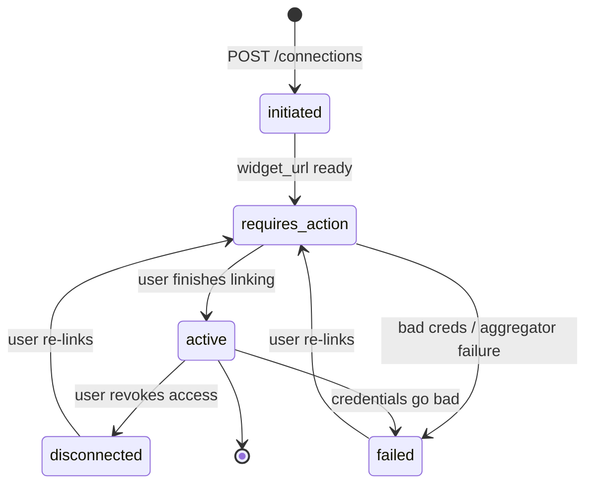

A **Connection** is one linked bank for one Client. It has a short, predictable lifecycle: you initiate it, the user finishes linking in a widget, and then data flows. This page walks the whole path, explains each status, and tells you what to do when a connection needs attention.

<Info>
Connections live under a Client: **Client → Connection → Account → Transaction / Statement**. One Client can own many Connections (one per linked bank). See [Connect a bank](/guides/connect-a-bank) for the end-to-end setup, and [Webhooks](/guides/webhooks) for the payloads referenced here.
</Info>

## The status flow


```mermaid
stateDiagram-v2
    [*] --> initiated: POST /connections
    initiated --> requires_action: widget_url ready
    requires_action --> active: user finishes linking
    requires_action --> failed: bad creds / aggregator failure
    active --> disconnected: user revokes access
    active --> failed: credentials go bad
    failed --> requires_action: user re-links
    disconnected --> requires_action: user re-links
    active --> [*]
```

A connection has five statuses:

| Status | Meaning | What you do |
| --- | --- | --- |
| `initiated` | You've kicked off the link; the widget URL isn't ready yet. Brief and transient. | Nothing — poll the operation; you'll see `requires_action` almost immediately. |
| `requires_action` | Someone needs to do something: finish the widget, re-enter credentials, answer an MFA challenge, or unlock the account at the bank. | Keep the widget open, or re-open the same `widget_url`. No auto-timeout. |
| `active` | Linked and healthy. Accounts, transactions, and statements are flowing. | Read data. Watch capability and refresh events. If the client opened a new account at this bank, see [Adding a new account](/guides/adding-accounts). |
| `failed` | The connection cannot be used, and re-entering credentials will not fix it on its own: the bank is unavailable, the bank is refusing automated access, or the aggregator reported a failure. | Show a re-link CTA. **Reauthorize in place** to keep your ids, or re-initiate. A later retry often succeeds with no user action at all. |
| `disconnected` | The user revoked access, or the link needs to be rebuilt. | Show a re-link CTA. **Reauthorize in place** to keep your ids, or re-initiate. |

<Note>
  **`requires_action` vs `failed` is the "can the user fix this?" split.** Branch on it rather than
  treating every unhealthy connection the same way:

  - **`requires_action`** — the user can fix it. Wrong password, an expired one-time code, a bank-forced
    password change, an account locked after too many sign-in attempts. Prompting them is worth doing.
  - **`failed`** — the user cannot fix it. The bank's site is down, the bank is blocking automated access,
    or our extraction failed. Prompting them for credentials here is the wrong call: they will re-enter
    correct credentials and it will still fail.

  Statement-only connections used to report some bank-side outages as `requires_action`, which sent
  integrators (and end clients) chasing credentials during a bank outage. Those now correctly report
  `failed`. If you branch on this field, expect a one-time shift of a small number of statement-only
  connections from `requires_action` to `failed`.
</Note>

## From initiate to active

You never poll the connection directly during setup. You read the **operation** you get back from the initiate call to collect the widget URL, then you wait for a webhook.

<Steps>
  <Step title="Initiate the connection">
    `POST /v3/clients/{id}/connections` with the institution id returns `202 Accepted` and an `operation_id`.

    ```bash Initiate
    curl -X POST https://api-sandbox.ledgersyncappv2.com/v3/clients/cli_01HXYZ.../connections \
      -H "Authorization: Bearer sk_test_..." \
      -H "Content-Type: application/json" \
      -d '{"institution_id":"ins_0a01a5430925d0b2"}'
    ```

    ```json 202 Accepted
    {
      "operation_id": "op_3d9c7f1e05b84a26bb4e8107c2fa9d53",
      "status": "queued",
      "poll_url": "/v3/operations/op_3d9c7f1e05b84a26bb4e8107c2fa9d53",
      "estimated_seconds": 5
    }
    ```

    <Note>There is no `source` field. v3 routes to Finicity, MX, or FDE server-side from the institution catalog.</Note>
  </Step>

  <Step title="Read the operation for the widget URL">
    `GET /v3/operations/{operation_id}`. The widget URL is at `result.connection.action.widget_url`. That is the only thing you need from this response.

    ```json Operation succeeded
    {
      "id": "op_3d9c7f1e05b84a26bb4e8107c2fa9d53",
      "type": "connection.initiate",
      "status": "succeeded",
      "result": {
        "kind": "connection_with_action",
        "connection": {
          "id": "con_9f1c2b7a-3e4d-4a11-8c2f-77e9b0d15a42",
          "client_id": "cli_9f2a4c1b8e07d3a5f6b20c14",
          "source": "FINICITY",
          "status": "requires_action",
          "action": {
            "kind": "widget_url",
            "widget_url": "https://connect.ledgersyncappv2.com/w/...",
            "expires_at": "2026-09-03T15:22:08Z"
          }
        }
      }
    }
    ```

    <Warning>
      `succeeded` here means the widget URL was issued, not that the bank is linked. This `result` is a snapshot written once and never rewritten, so whatever id it holds is the id it will hold forever. For Finicity and MX that is a `con_<uuid>` placeholder. Do not wait on this endpoint for the id to change; it never does.
    </Warning>
  </Step>

  <Step title="Hand off the widget">
    Open `widget_url` in the user's browser (redirect, iframe, or webview). They pick their bank, sign in, pick accounts, and close it. You never see or transmit credentials. See [Connect a bank](/guides/connect-a-bank) for widget details.
  </Step>

  <Step title="Wait for connection.active">
    When the user finishes, the connection flips to `active` and you receive a `connection.active` webhook carrying the **canonical** connection id. Store that id.
  </Step>
</Steps>

## The two id formats

This trips people up, so read it twice.

<Warning>
A connection has **two** id formats over its life. Only one works for reads.
</Warning>

- **Placeholder** — `con_` followed by a UUID (e.g. `con_9f1c2b7a-3e4d-4a11-8c2f-77e9b0d15a42`). This is what a Finicity or MX initiate returns. It is valid **only** for the widget step.
- **Canonical** — `con_<SOURCE>_<bankAccountId>` (e.g. `con_FINICITY_41294`, `con_MX_1224`). This is the **only** id that works on `/accounts`, `/transactions`, and `/statements`.

**Tell them apart by shape, not by where you got them.** The initiate operation writes its result once and never rewrites it, so a placeholder there stays a placeholder however long you poll. (FDE is the exception: it can return the canonical id at initiate. Checking the shape handles both without special-casing the source.)

When you hold a placeholder, the canonical id comes from the `connection.active` webhook payload (`data.connection.id`), or from `GET /v3/clients/{client_id}/connections` if you cannot run a webhook handler. Never persist a placeholder as your connection reference.

<Tip>
Ids encode their source everywhere: `con_FINICITY_...`, `acc_MX_...`, `txn_FDE_...`. You can read the source off any id at a glance.
</Tip>

<Note>
This is the single most common mistake in AI-generated integrations, because it fails at the *next* call rather than where the wrong id was stored. If an assistant wrote your code, see [If something is not working](/guides/build-with-ai#4-if-something-is-not-working).
</Note>

## Handling requires_action

`requires_action` means the ball is in the user's court. They opened the widget but have not finished picking accounts and signing in.

There is **no auto-timeout to `failed` today**. A connection stays `requires_action` until either:

- the user re-opens the still-valid `widget_url` and completes it, or
- you re-initiate the connection to get a fresh operation and widget URL.

So if a user wanders off mid-link, nothing breaks. Re-surface the same widget URL, or start over with a new `POST /connections`.

### MFA and reauthorization

MFA is handled entirely inside the widget. When a real bank challenges the user for a one-time code or security question, that challenge is presented and answered **in the LedgerSync-hosted page** — the same `widget_url` you already opened. You route the user back to it and they finish there.

<Warning>
There is **no programmatic MFA endpoint**. You never receive, submit, or store bank credentials or MFA answers through the API. That is the point of the hosted model: raw secrets never touch your servers.
</Warning>

So handling `requires_action` for MFA is the same as handling it for the initial link: re-open the connection's `widget_url` (or re-initiate to mint a fresh one) and wait for `connection.active`.

The `action` object on a `requires_action` connection is a tagged union — read its `kind` to know what to render:

| `action.kind` | Fields | Status |
| --- | --- | --- |
| `widget_url` | `widget_url`, `expires_at` | **The only kind emitted on a `requires_action` connection.** Open the URL in a browser, iframe, or webview. |
| `reauthorize` | `reauth_url`, `expires_at` | Returned on demand by [`POST /connections/{id}/reauthorize`](#handling-failed-and-disconnected) to repair a connection in place. **Not gated on status**: it is also valid on an `active` connection, which is how you let a client add an account (see [Reauthorizing an active connection](#reauthorizing-an-active-connection)). Not emitted on a `requires_action` connection's own `action`. |
| `mfa_challenge` | `challenge_id`, `questions[]` | Reserved for a future release — not emitted today. There is intentionally no inline MFA-answer flow. |

<Note>
On a `requires_action` connection the `action` is always `widget_url` — first-time MFA, a step-up challenge, or a password-change reauthorization all surface there. The `reauthorize` kind is returned only when you explicitly call the reauthorize endpoint (below); `mfa_challenge` is not emitted yet. Branch on `kind` anyway so your integration keeps working when the other kinds ship.
</Note>

## Handling failed and disconnected

Both statuses mean the same thing to your UI: **the user needs to re-link.** You have two ways to do it, and they differ in one thing that matters — whether your stored ids survive.

- `failed` — bad credentials, or the aggregator reported a failure. Common after a password change at the bank.
- `disconnected` — the user revoked access on their side, or the link otherwise needs rebuilding.

### Reauthorize in place — keeps your ids (recommended)

`POST /v3/connections/{connection_id}/reauthorize` repairs the **existing** connection. It returns a `reauthorize` action with a LedgerSync-hosted `reauth_url`:

```json
{
  "connection_id": "con_FINICITY_41294",
  "source": "FINICITY",
  "action": {
    "kind": "reauthorize",
    "reauth_url": "https://connect.ledgersyncappv2.com/...",
    "expires_at": "2026-07-27T12:00:00Z"
  }
}
```

Redirect the user to `reauth_url` to re-enter credentials or re-consent at the institution, then wait for `connection.active`. When the repair stays on the same source (check the `source` field, and read the warning below), it repairs this very connection: its `con_`, `acc_`, and `txn_` ids stay **the same**, so a delta re-sync over the overlap window dedupes cleanly against transactions you already have.

<Info>
Ownership is enforced server-side: a `connection_id` that doesn't belong to the authenticated customer returns `404`. Available for `FINICITY`, `MX`, and `FDE`. Uploaded-statement (`PDF`) sources are read-only and have no connection to reauthorize.
</Info>

<Warning>
**Id stability is not unconditional.** `source` names the source the returned URL actually leads to, and it is not always the source in the connection id you passed: at a few institutions a `con_FINICITY_*` connection reauthorizes through **MX**, the user links a **new** connection, and the accounts arrive under new `con_` / `acc_` / `txn_` ids while the original connection keeps its old ones. Compare `source` against the source segment of the id you sent before assuming your ids survived. See [Adding a new account](/guides/adding-accounts#finicity-reauthorize-the-active-connection).

Whether an institution can be repaired in place at all also depends on the aggregator. If reauthorize can't recover the connection, fall back to re-initiate.
</Warning>

### Re-initiate — fresh connection, new ids

Re-linking with `POST /v3/clients/{id}/connections` runs the initiate → widget → active flow again for the same Client. Use it when you want (or need) a brand-new connection.

<Warning>
When the aggregator issues a new underlying login, a fresh connection **mints new `con_` / `acc_` / `txn_` ids** for the same accounts — so a delta pull can return transactions you already hold under new ids. Prefer **reauthorize** when you want id stability; keep re-initiate as the fallback.
</Warning>

<Note>
Prefer not to build a bank picker at all? Use the hosted [connect session](/guides/connect-a-bank) — `POST /v3/clients/{id}/connect-session` returns a LedgerSync-hosted `url` you email the user. Same lifecycle, none of the widget plumbing.
</Note>

## Reauthorizing an active connection

Reauthorize is not only a repair path. The endpoint does **not** check the connection's status, so a healthy `active` connection is a valid target.

The one common reason to use it that way is **account discovery on Finicity**. When a client opens a new account at a bank they already linked, a Finicity refresh will never return it: the account set is fixed at consent time, and only a hosted session offers the accounts the client did not share. Reauthorize mints that session against the existing connection. MX and FDE need nothing here, because their refresh already picks up new accounts.

<Warning>
Reauthorize does not always keep you on the same source. The response carries a `source` field naming the source the returned URL leads to, and on a few institutions a `con_FINICITY_*` connection reauthorizes through MX, which lands the accounts on a **new** connection with new ids. Branch on `source` rather than assuming id stability.
</Warning>

<Warning>
**Do not loop and do not schedule reauthorize.** Each call mints a session a human has to sit through, and a completed session ends in a real aggregation at the institution, which is not free. Call it once, on a real trigger, and wait for the client to open the link you already sent.
</Warning>

<Card title="Adding a new account" icon="plus" href="/guides/adding-accounts">
The full per-source table, the Finicity reauthorize flow, and how to detect the new account once it lands.
</Card>

## Per-capability health

An `active` connection is not all-or-nothing. Each connection carries individual **capabilities** that can flip working or not-working on their own:

`transactions`, `balance`, `available_balance`, `statements`, `check_images`.

`check_images` is FDE-only; see [Check images](/guides/checks) for how to read them.

When one of these transitions, you get a `connection.capability_changed` webhook. To avoid flapping, LedgerSync applies hysteresis: **3 consecutive failed** observations before a capability is marked `failed`, and **2 consecutive succeeded** before it flips back. The event fires only on a real transition, not on every refresh. It carries a `data.change` object holding `capability`, `previous_status`, `current_status`, `consecutive_observations`, and `last_error` when the capability failed.

This lets you show precise UI, for example "transactions are syncing, but statements are temporarily unavailable," without dropping the whole connection.

<Card title="Capability payload details" icon="webhook" href="/guides/webhooks">
See the full `connection.capability_changed` payload, statuses, and field-by-field breakdown in the Webhooks guide.
</Card>

## Data freshness and refresh

Once a connection is `active`, LedgerSync keeps its data fresh in the background. You do not poll for new data — you listen for refresh events:

- `account.refresh.completed` — a refresh finished and new transactions/balances are available to read.
- `account.refresh.failed` — a refresh attempt failed. If failures persist, the connection may move to `failed` or a capability may change.

Treat `account.refresh.completed` as your signal to re-read `/accounts` and `/transactions` for that Client and connection.

```bash Read after a refresh
curl "https://api-sandbox.ledgersyncappv2.com/v3/accounts?client_id=cli_01HXYZ...&connection_id=con_FINICITY_41294" \
  -H "Authorization: Bearer sk_test_..."
```

<Warning>
Reads are **Client-scoped**. Always pass `client_id` on every read, alongside the canonical `connection_id`.
</Warning>

## Account types

Every account you read off an `active` connection carries a `type`. It is never null, and it is always one of six values. LedgerSync folds each source's own account label into this enum, so the same value means the same thing whichever aggregator the account came from and you can branch on it without knowing the source:

| `type` | What it is |
| --- | --- |
| `checking` | Everyday transaction / demand-deposit account. |
| `savings` | Savings, money-market, CD. |
| `credit_card` | Revolving credit card. |
| `loan` | Term loan, mortgage, auto loan, line of credit. |
| `investment` | Brokerage, IRA, 401(k), and other holdings accounts. |
| `other` | Anything the source didn't classify into the above. |

### Asset vs liability

`current_balance` is signed from the account holder's point of view, and that is a LedgerSync guarantee rather than a per-source quirk: **positive is value the client holds, negative is value they owe.** Summing `current_balance` across a client's accounts gives net worth, with no per-source branching and no sign flipping of your own.

So a credit card or loan carrying a balance is negative, and a checking account in overdraft is negative too. The sign is meaningful in both directions: an overpaid card with a real credit balance comes back positive.

<Note>
`available_balance` is **not** signed this way. On a credit card it is available credit, an amount the client can spend, so it is positive. MX is the only source that reports it.
</Note>

The side each `type` sits on, for classification:

| Side | Types |
| --- | --- |
| Asset | `checking`, `savings`, `investment` |
| Liability | `credit_card`, `loan` |
| Ambiguous | `other` |

<Warning>
Treat `other` as unknown, not as an asset. Don't fold it into a net-worth total without inspecting the account. New or unclassified account kinds land here.
</Warning>

### Credit-card terms

A credit card or line of credit can carry a **`liabilities`** object with the terms the bank publishes:

```json
{
  "id": "acc_FINICITY_84213",
  "type": "credit_card",
  "current_balance": -14381.66,
  "last_refreshed_at": "2026-09-04T06:12:03Z",
  "liabilities": {
    "credit_limit": 65000.00,
    "available_credit": 50596.54,
    "statement_balance": -14381.66,
    "minimum_payment": 143.00,
    "payment_due_date": "2026-09-24"
  }
}
```

**The object is absent unless we know something.** It is null for every account that is not a card or line of credit, and null for cards at banks that publish no terms. Its presence is the signal, so check for the object before reading fields inside it. Individual fields are independently nullable for the same reason: an absent field means the bank did not report it, never that the value is zero.

Coverage differs by source:

| Source | What it reports |
| --- | --- |
| Finicity | All five fields, where the bank publishes them |
| MX | Everything except the statement balance, which MX does not track |
| Portal connections (FDE) | None, so `liabilities` is always null |
| Uploaded statements | None, so `liabilities` is always null |

**`statement_balance` follows the same sign rule as `current_balance`:** what the client owes is negative, so the two agree on the same account.

<Warning>
That sign is normalized by us, not reported. Banks disagree with each other about it, several of them reporting a card's statement balance as a positive number while reporting the same debt as a negative account balance. We resolve it to "owed is negative" so you never have to know which convention a given bank used.

One consequence is worth knowing: a card that was **in credit** at statement close, because the holder overpaid, is indistinguishable from one that owed the same amount and is reported as owed. `credit_limit`, `available_credit` and `minimum_payment` are always positive.
</Warning>

<Note>
`payment_due_date` is the bank's own figure and only as current as the last refresh. A bank that has not yet published a new cycle is still reporting the previous one, so **a date in the past means the cycle rolled over and we have not seen the new one**, not that a payment is overdue. Read `last_refreshed_at` before acting on it.
</Note>

### The enum is intentionally coarse

Banks expose far richer sub-types than these six. An investment household might show up as IRA, 401(k), or brokerage; a lending product as mortgage, auto loan, or line of credit. Those rich labels **collapse** into the coarse enum — IRA/401(k)/brokerage all become `investment`, mortgage/auto loan/line of credit all become `loan`.

Nothing is lost when they do. The finer label survives on **`subtype`**, which is always present alongside `type`:

| `subtype` | `type` |
| --- | --- |
| `money_market`, `certificate_of_deposit` | `savings` |
| `mortgage`, `line_of_credit` | `loan` |
| `ira`, `roth`, `rollover`, `plan_401k`, `plan_529`, `investment_tax_deferred` | `investment` |
| `bank` | `checking` |
| `other_liability`, `rewards`, `cash`, `prepaid` | `other` |
| `unknown` | `other` |

`subtype` is an **open vocabulary**, deliberately not an enum: new values appear as sources start reporting new products, and a new value is never a breaking change. `type` is the opposite, closed and stable. So branch on `type`; use `subtype` for display, or for finer routing you control and can update.

<Warning>
`subtype` is `unknown` when the source reported no account type at all. That is every FDE account, and roughly half of the accounts created from uploaded statements. Those accounts report `type: other`, so treat `other` as "not classified", not as a category.
</Warning>

<Info>
Per-account data availability is **not** derived from `type`. A `savings` account isn't guaranteed to expose statements, and a `loan` isn't guaranteed to expose transactions. Read each account's `realized_capabilities` block to know what's actually available. (Today the backend tracks capability status at the bank level, so accounts within one connection share the same snapshot — see [Per-capability health](#per-capability-health).)
</Info>

## Test the whole lifecycle in sandbox

You can drive this entire flow without a real bank. Search `?q=FinBank`, pick the row named exactly **"FinBank"**, and sign in with Banking Userid `demo` / Banking Password `go`. It flips to `active` immediately with no MFA and auto-populates accounts, transactions, and statements.

<CardGroup cols={2}>
  <Card title="Connect a bank" icon="link" href="/guides/connect-a-bank">
    The full initiate → widget → active walkthrough.
  </Card>
  <Card title="Webhooks" icon="webhook" href="/guides/webhooks">
    Every lifecycle event, its payload, and how to verify signatures.
  </Card>
  <Card title="Testing" icon="flask" href="/guides/testing">
    Sandbox banks, MFA/OAuth variants, and credentials.
  </Card>
  <Card title="Errors" icon="triangle-exclamation" href="/guides/errors">
    The error envelope and how to branch on `code`.
  </Card>
</CardGroup>
