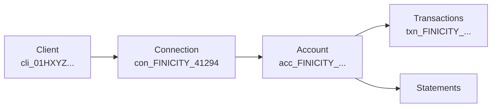

This is the end-to-end path: mint a key, register a webhook, create a Client, find a bank, initiate a connection, hand off the widget, and read back accounts and transactions. Every call here uses the **sandbox** base URL and a test bank, so you can run the whole thing without touching real credentials.

<Info>
  **Base URL (sandbox):** `https://api-sandbox.ledgersyncappv2.com/v3` &nbsp;·&nbsp; **Auth:** `Authorization: Bearer sk_test_...` &nbsp;·&nbsp; Every response carries an `X-LS-Trace-Id` header — grab it if you ever open a support ticket.
</Info>

## Prefer Postman?

Import our collection and run the whole flow without leaving Postman. The
**Quickstart** folder chains every step below and captures ids for you, so you
can run it top-to-bottom.

<Steps>
  <Step title="Import the collection">
    In Postman, **Import → Link** and paste the hosted URL (or download it and **Import → File**):

    ```
    https://portal.ledgersyncappv2.com/ledgersync-v3.postman_collection.json
    ```

    It ships folders for every resource — Clients, Connections, Accounts, Transactions, Statements, Operations, Webhooks, Institutions, and more — plus the chained **Quickstart** folder.
  </Step>
  <Step title="Set two variables">
    On the collection, set `api_key` to your key and point `base_url` at the environment you're testing:

    | Variable | Sandbox | Live |
    | --- | --- | --- |
    | `api_key` | your `sk_test_...` | your `sk_live_...` |
    | `base_url` | `https://api-sandbox.ledgersyncappv2.com/v3` | `https://api.ledgersyncappv2.com/v3` |
  </Step>
  <Step title="Run the Quickstart folder">
    Run it top-to-bottom — it creates a Client, discovers an institution, initiates a connection, and captures each returned id into the collection variables for the next request.
  </Step>
</Steps>

<Tip>
  Prefer a raw, always-current endpoint list? Postman can import our OpenAPI
  spec directly: **Import → Link** →
  `https://api.ledgersyncappv2.com/v3/openapi.yaml`.
</Tip>

## The mental model

Four objects, one line of descent. A **Client** is your record of one end-user. Each Client owns one or more **Connections** (one per linked bank). Each Connection exposes **Accounts**, and each Account has **Transactions** and **Statements**.



Two things to internalize now, because they save debugging later:

- **You never see bank credentials.** The user types them into a LedgerSync-hosted widget. You just open a URL.
- **The data source is chosen for you.** LedgerSync routes each institution to Finicity, MX, or FDE server-side. There is no `source` parameter — the id you pass (`ins_...`) already encodes everything.

<CardGroup cols={3}>
  <Card title="Finicity" icon="building-columns">
    Broadest US coverage. OAuth where the bank supports it.
  </Card>
  <Card title="MX" icon="shuffle">
    Alternate aggregator. Catches banks Finicity misses.
  </Card>
  <Card title="FDE" icon="file-lock">
    LedgerSync's proprietary extraction for banks neither aggregator covers.
  </Card>
</CardGroup>

<Steps>

<Step title="Mint a sandbox key">
  In the portal, open **Developers → API keys** and create a sandbox key. It starts with `sk_test_` — live keys start with `sk_live_`. Keep test and live strictly separate; they hit different base URLs and different data.

  Set it in your shell so the snippets below just work:

  ```bash
  export LS_KEY="sk_test_your_key_here"
  export LS_BASE="https://api-sandbox.ledgersyncappv2.com/v3"
  ```

  Confirm it authenticates:

  ```bash
  curl "$LS_BASE/institutions?q=chase" \
    -H "Authorization: Bearer $LS_KEY"
  ```

  A `401` means a bad or missing key. See [Authentication](/authentication) for the full contract.
</Step>

<Step title="Register a webhook subscription">
  Connections finish **asynchronously** — the user could take thirty seconds or ten minutes inside the widget. Rather than poll forever, subscribe to webhooks and react when `connection.active` arrives.

  The easiest path is the **portal Webhooks page** — add your endpoint, pick events, and see deliveries and retries visually. To do it over the API, subscribe to all eight event types:

  ```bash
  curl -X POST "$LS_BASE/webhooks/subscriptions" \
    -H "Authorization: Bearer $LS_KEY" \
    -H "Content-Type: application/json" \
    -d '{
      "url": "https://yourapp.example.com/webhooks/ledgersync",
      "event_types": [
        "connection.initiated",
        "connection.requires_action",
        "connection.active",
        "connection.failed",
        "connection.disconnected",
        "connection.capability_changed",
        "account.refresh.completed",
        "account.refresh.failed"
      ]
    }'
  ```

  The response includes a `signing_secret`:

  ```json
  {
    "id": "whsub_01HXYZ8QK3...",
    "url": "https://yourapp.example.com/webhooks/ledgersync",
    "signing_secret": "whsec_9f2a...c1",
    "event_types": ["connection.initiated", "connection.active", "..."]
  }
  ```

  <Warning>
    The `signing_secret` is shown **once**. Store it now — you need it to verify every incoming delivery. If you lose it, rotate the subscription.
  </Warning>

  Verify signatures constant-time and dedupe on `event_id`. The full recipe (headers, HMAC, retries, the 30-second ack window) is in the [Webhooks guide](/guides/webhooks). Want to see a payload land right away? Fire a test:

  ```bash
  curl -X POST "$LS_BASE/webhooks/subscriptions/whsub_01HXYZ8QK3.../test" \
    -H "Authorization: Bearer $LS_KEY"
  ```
</Step>

<Step title="Create a Client">
  A Client represents one end-user. Set `external_id` to whatever you use internally (a user id, org id, however you key it) so you can cross-reference without storing our ids everywhere.

  ```bash
  curl -X POST "$LS_BASE/clients" \
    -H "Authorization: Bearer $LS_KEY" \
    -H "Content-Type: application/json" \
    -d '{ "external_id": "user_4820", "name": "Acme Bookkeeping LLC" }'
  ```

  ```json
  {
    "id": "cli_01HXYZ7ABCDEF...",
    "external_id": "user_4820",
    "name": "Acme Bookkeeping LLC"
  }
  ```

  Hold onto `cli_01HXYZ7ABCDEF...` — every read later is scoped to it.
</Step>

<Step title="Discover the institution">
  Search the catalog to get the `institution_id` you'll connect to. Each row carries a `capabilities` block so you know upfront what a bank supports.

  ```bash
  curl "$LS_BASE/institutions?q=FinBank" \
    -H "Authorization: Bearer $LS_KEY"
  ```

  ```json
  {
    "data": [
      {
        "id": "ins_0a01a5430925d0b2",
        "name": "FinBank",
        "capabilities": {
          "oauth": false,
          "transactions": true,
          "statements": true,
          "check_images": false
        }
      }
    ]
  }
  ```

  <Tip>
    Pick the row whose `name` matches what you searched. `?q=FinBank` can return several FinBank variants — grab the one named exactly **FinBank** for the no-MFA happy path.
  </Tip>
</Step>

<Step title="Initiate the Connection">
  Create a Connection under the Client with just the `institution_id`. No source, no credentials.

  ```bash
  curl -X POST "$LS_BASE/clients/cli_01HXYZ7ABCDEF.../connections" \
    -H "Authorization: Bearer $LS_KEY" \
    -H "Content-Type: application/json" \
    -d '{ "institution_id": "ins_0a01a5430925d0b2" }'
  ```

  You get back `202 Accepted` and an `operation_id`. The connection is being set up in the background.

  ```json
  {
    "operation_id": "op_01HXYZQWERTY...",
    "status": "pending"
  }
  ```

  Poll the operation until it succeeds:

  ```bash
  curl "$LS_BASE/operations/op_01HXYZQWERTY..." \
    -H "Authorization: Bearer $LS_KEY"
  ```

  ```json
  {
    "operation_id": "op_01HXYZQWERTY...",
    "status": "succeeded",
    "result": {
      "connection": {
        "id": "con_5f8c1e2a-7b3d-4a9e-9c11-2f6d0a4b8e21",
        "status": "requires_action",
        "action": {
          "widget_url": "https://connect.ledgersyncappv2.com/w/eyJhbGci..."
        }
      }
    }
  }
  ```

  <Warning>
    That `con_<uuid>` is a **placeholder**, valid only for the widget step. Once the user finishes and `connection.active` fires, the id becomes canonical — `con_FINICITY_41294`, `con_MX_1224`, and so on. **Only the canonical id works** on `/accounts`, `/transactions`, and `/statements`. Store the canonical id from the succeeded connection; never persist the placeholder.
  </Warning>
</Step>

<Step title="Hand off the widget">
  Open `widget_url` in the user's browser — redirect, iframe, or webview, whatever fits your app. The user searches for their bank, signs in (credentials or the bank's own OAuth), picks accounts, and closes it. **Credentials go to the bank, never through you.**

  A small nuance by source: Finicity and MX show an aggregator widget with a bank search; FDE shows a LedgerSync-hosted connect page with the bank already chosen (no search, since `institution_id` fixed it).

  <Note>
    **Don't want to build a picker at all?** Use the hosted link instead: `POST /v3/clients/{id}/connect-session` returns `{ url, expires_at }` — a LedgerSync-hosted page you email the member. They search, pick, and connect their own bank; you revoke with `DELETE /v3/clients/{id}/connect-session/{sid}`. See [Connect a bank](/guides/connect-a-bank) for both flows side by side.
  </Note>
</Step>

<Step title="Receive connection.active">
  When the user finishes, LedgerSync fires `connection.active` to your webhook. This is your signal that data is flowing and the canonical id is ready.

  ```json
  {
    "event_id": "evt_01HXYZACTIVE...",
    "type": "connection.active",
    "data": {
      "connection": {
        "id": "con_FINICITY_41294",
        "status": "active",
        "client_id": "cli_01HXYZ7ABCDEF...",
        "institution_id": "ins_0a01a5430925d0b2"
      }
    }
  }
  ```

  Persist `con_FINICITY_41294` against your user. That's the id you'll use for every read. (The other statuses — `requires_action`, `failed`, `disconnected` — are covered in the [Connection lifecycle](/guides/connection-lifecycle) guide.)
</Step>

<Step title="List accounts and transactions">
  Reads are **Client-scoped** — pass `client_id` on every one. Start with the accounts on this connection:

  ```bash
  curl "$LS_BASE/accounts?client_id=cli_01HXYZ7ABCDEF...&connection_id=con_FINICITY_41294" \
    -H "Authorization: Bearer $LS_KEY"
  ```

  ```json
  {
    "data": [
      {
        "id": "acc_FINICITY_889201",
        "name": "FinBank Checking",
        "type": "checking",
        "balance": 4210.55,
        "currency": "USD"
      }
    ]
  }
  ```

  Then pull transactions for an account, filtered by date:

  ```bash
  curl "$LS_BASE/accounts/acc_FINICITY_889201/transactions?client_id=cli_01HXYZ7ABCDEF...&from=2026-01-01" \
    -H "Authorization: Bearer $LS_KEY"
  ```

  ```json
  {
    "data": [
      {
        "id": "txn_FINICITY_5521398",
        "account_id": "acc_FINICITY_889201",
        "date": "2026-01-14",
        "amount": -42.17,
        "description": "COFFEE HOUSE #221",
        "pending": false
      }
    ]
  }
  ```

  <Check>
    That's the full loop — Client → Connection → Account → Transactions. The ids encode their source (`acc_FINICITY_...`, `txn_MX_...`, `txn_FDE_...`), but the shapes are identical no matter which aggregator served them.
  </Check>
</Step>

</Steps>

## Testing with FinBank

<Note>
  **The no-MFA happy path.** Search `?q=FinBank` and pick the row named exactly **FinBank**. In the widget, sign in with **Banking Userid `demo`** / **Banking Password `go`**. It flips to `active` immediately — no MFA, no OAuth round-trip — and auto-populates accounts, transactions, and statements. To exercise FDE instead, use **"Ledgersync Bank"** (`ins_a7397a8d0656e1b7`). The full bank list, plus MFA and OAuth variants and their credentials, lives in the portal Testing playbook.
</Note>

## Handling errors

Every error returns the same envelope — branch on `code`, not on the HTTP status alone:

```json
{
  "error": {
    "code": "not_found",
    "message": "No institution matches ins_deadbeef.",
    "type": "not_found",
    "doc_url": "https://portal.ledgersyncappv2.com/errors/not_found",
    "trace_id": "4bf92f3577b34da6a3ce929d0e0e4736"
  }
}
```

| HTTP | Meaning |
| --- | --- |
| 400 | Validation — something in your request body or params is off |
| 401 | Auth — bad or missing key |
| 404 | Not found |
| 429 | Rate limited — back off and retry |
| 5xx | Server error — retry, and quote `X-LS-Trace-Id` if it persists |

Details and every code in the [Errors guide](/guides/errors).

## Where to go next

<CardGroup cols={2}>
  <Card title="Connect a bank" icon="link" href="/guides/connect-a-bank">
    The widget flow and the hosted connect-session link, in depth.
  </Card>
  <Card title="Webhooks" icon="webhook" href="/guides/webhooks">
    Verify signatures, dedupe on event_id, handle retries.
  </Card>
  <Card title="Connection lifecycle" icon="arrows-rotate" href="/guides/connection-lifecycle">
    requires_action, active, failed, disconnected — and capability changes.
  </Card>
  <Card title="API reference" icon="book" href="/api-reference">
    Every endpoint, parameter, and response shape.
  </Card>
</CardGroup>
