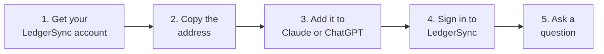

Chat with Claude or ChatGPT about your clients' bank accounts. It finds the answer in LedgerSync.

<Note>
  You need Claude, or ChatGPT Plus or higher on chatgpt.com. Does your firm use Claude Team or Enterprise,
  or ChatGPT Business? Ask your admin to allow LedgerSync first.
</Note>



## 1. Get your LedgerSync account

Pick the one that fits you.

**Does your firm already use the LedgerSync app?** Do not sign up as new and do not pay. Click **My firm
already uses the LedgerSync app** below.

**Already signed up here, or already use the LedgerSync developer portal?** Skip to
[2. Copy this address](#2-copy-this-address).

<Note>
  One person per firm does this. Someone at your firm already did it? Do not sign up again. Ask them.
</Note>

<Tabs>
  <Tab title="New to LedgerSync">
    <Steps>
      <Step title="Open the sign-up page">
        Open [portal.ledgersyncappv2.com/start/ai/new](https://portal.ledgersyncappv2.com/start/ai/new).
      </Step>
      <Step title="Type your name and work email">
        Then click **Continue**. Or click **Continue with Google**.

        <Frame>
          
        </Frame>

        Write down the email you use. You need it in part 4.
      </Step>
      <Step title="Type the code we email you">
        Used **Continue with Google**? Skip this.
      </Step>
      <Step title="Type your firm's name">
        The page says **Step 1 of 2**. Type your firm's name.

        Tick **I agree**.

        Wait until the Cloudflare box says **Success!** If it shows a box to tick, tick it.

        Click **Continue to add your card**.

        <Frame>
          
        </Frame>
      </Step>
      <Step title="Add your card">
        The page says **Step 2 of 2**. Type your card on the page and finish.

        Your first charge is one month after you add your card. Your card is kept by Zoho, our billing
        partner. We never see the full number.

        Then you see **Thanks! We are checking your firm.**
      </Step>
      <Step title="We check your firm">
        We check every firm by hand, within 2 business days, and we email you. If we cannot approve your
        firm, your card will not be charged.
      </Step>
      <Step title="Add LedgerSync to your AI now">
        You do not need to wait. Go down to [2. Copy this address](#2-copy-this-address). Do parts 2, 3 and 4.

        When our "You're approved" email comes, do part 5. LedgerSync starts working by itself.
      </Step>
    </Steps>
  </Tab>
  <Tab title="My firm already uses the LedgerSync app">
    <Steps>
      <Step title="Open the connect page">
        Open [portal.ledgersyncappv2.com/start/link](https://portal.ledgersyncappv2.com/start/link).

        You see a **Sign in** page. This website needs its own sign-in, and your LedgerSync app username does
        not work here. Click **Sign up** at the bottom and use your work email. This does not create another
        paid plan.

        Made a sign-in here before? Just sign in.

        Write down the email you use. You need it in part 4.
      </Step>
      <Step title="Click Email support">
        <Frame>
          
        </Frame>

        Your email opens with a message ready. Fill in your firm's name and your LedgerSync app username.
        Click **Send**. Never send your password.

        Nothing opened? Write to [support@ledgersync.com](mailto:support@ledgersync.com). Tell us the email
        shown on the page, your firm's name and your app username.
      </Step>
      <Step title="We connect your account">
        We reply to your email when it is done. There is no new plan and no extra charge.
      </Step>
      <Step title="Add LedgerSync to your AI">
        After our reply, go down to [2. Copy this address](#2-copy-this-address). Do parts 2 to 5.

        In part 4, sign in with the email shown on the connect page. Not your app username.
      </Step>
    </Steps>
  </Tab>
</Tabs>

## 2. Copy this address

Click the copy icon on the right of the box.

```text
https://api.ledgersyncappv2.com/mcp
```

To paste it in part 3: click the address box, then press **Ctrl+V** (Windows) or **Command+V** (Mac).

## 3. Add it to your AI

<Tabs>
  <Tab title="Claude">
    <Steps>
      <Step title="Click Customize, then Connectors">
        Open [claude.ai](https://claude.ai). No menu on the left? Click the sidebar button at the top left.

        <Frame>
          
        </Frame>

        Click **Yours**. Is LedgerSync already there?

        - It says **Connected**: go to [5. Ask](#5-ask).
        - It shows **Connect**: click it and go to [4. Sign in to LedgerSync](#4-sign-in-to-ledgersync).
        - It is not there: do the next step.
      </Step>
      <Step title="Click Add, then Add custom connector">
        <Frame>
          
        </Frame>
      </Step>
      <Step title="Type LedgerSync, paste the address, click Continue">
        <Frame>
          
        </Frame>

        Claude says **A connector with this URL already exists**? LedgerSync is already added. Go back to
        **Yours** in the step above.
      </Step>
      <Step title="Click Add">
        Do not change anything on this screen.

        <Frame>
          
        </Frame>
      </Step>
      <Step title="Click Connect">
        <Frame>
          
        </Frame>

        The LedgerSync sign-in page opens. Go to [4. Sign in to LedgerSync](#4-sign-in-to-ledgersync).
      </Step>
    </Steps>
  </Tab>
  <Tab title="ChatGPT">
    <Steps>
      <Step title="Open chatgpt.com and click Plugins, then Add">
        <Frame>
          
        </Frame>
      </Step>
      <Step title="Click Create MCP App">
        <Frame>
          
        </Frame>
      </Step>
      <Step title="Fill in the New Plugin form">
        1. In **Name**, type **LedgerSync**.
        2. Keep **Server URL**. Paste the address from part 2 in the box below it.
        3. Keep **OAuth** under **Authentication**.
        4. Tick the box **I understand and want to continue**.
        5. Click **Create**.

        <Frame>
          
        </Frame>

        Then go to [4. Sign in to LedgerSync](#4-sign-in-to-ledgersync).
      </Step>
    </Steps>
  </Tab>
</Tabs>

## 4. Sign in to LedgerSync

Sign in with the same email as in step 1.

Used **Continue with Google** in step 1? Click it again here. If not, type your email and click **Continue
with email**. Got a code by email? Type it on the page. Developers: use your developer portal sign-in.

<Frame>
  
</Frame>

Then click **Allow access**. You only see this the first time.

<Frame>
  
</Frame>

<Accordion title="Optional, Claude only: let Claude read without asking each time">
  In **Customize**, then **Connectors**, click **LedgerSync**. Next to **Read-only tools**, pick **Always
  allow**. Claude still asks before it changes anything.

  <Frame>
    
  </Frame>
</Accordion>

## 5. Ask

Open a new chat: in Claude click **New**, in ChatGPT click **New chat**.

Ask first: "Use LedgerSync to check whether my account is ready."

- It says LedgerSync is ready: ask anything below.
- It says we are checking your sign-up: wait for our "You're approved" email.
- Anything else: see [Something wrong?](#something-wrong) below.

### New account? Start here

A new LedgerSync account has no clients yet. Add your first one. Acme is an example: use your client's name.

<Steps>
  <Step title="Add a client and get a bank link">
    Ask: "Add my client Acme and give me a link to connect their bank."
  </Step>
  <Step title="Open the link and connect the bank">
    Open the link. Pick your client's bank and sign in with their bank login. This happens on a LedgerSync
    page, never in the chat.

    Don't have their bank login? Send the link to your client by email or text, and they do it. The link
    works for 3 days.
  </Step>
  <Step title="Ask about their bank">
    When the bank is connected, ask: "Show Acme's bank balances."
  </Step>
</Steps>

<Tip>
  Already use the LedgerSync app? Your clients are already here. Go straight to the examples below.
</Tip>

### More things to ask

<CardGroup cols={2}>
  <Card title="Is a bank supported?" icon="building-columns">
    "Does LedgerSync work with First National Bank?"
  </Card>
  <Card title="Find a client" icon="magnifying-glass">
    "Find my client Acme."
  </Card>
  <Card title="Balances" icon="wallet">
    "Show Acme's bank balances."
  </Card>
  <Card title="Transactions" icon="list">
    "Show last month's transactions for Acme's checking account."
  </Card>
  <Card title="Statements" icon="file-pdf">
    "Get Acme's September bank statement."
  </Card>
  <Card title="Problems" icon="triangle-exclamation">
    "Which of my clients' banks are not working?"
  </Card>
  <Card title="Connect a bank" icon="link">
    "Send Acme a link to connect their bank."
  </Card>
</CardGroup>

<Note>
  **Nobody types a bank password in the chat.** When a bank needs a password, the AI gives you a link to a
  LedgerSync page. The password goes there.
</Note>

<Tip>
  Before the AI changes something, it asks you first. Say yes if it looks right.
</Tip>

## Banks that need the LedgerSync desktop app

A few banks need the LedgerSync desktop app when the AI refreshes them. The app runs on a computer at your firm.

**Which banks?** The AI tells you. When you look up a bank or check a connection, it says if that bank
needs the desktop app.

You set up the app once.

<Steps>
  <Step title="Get the app">
    Ask: "Help me set up the LedgerSync desktop app." The AI gives you the download link for your computer.

    Or download it here: [Windows](https://api.fdels.com/api/v2/proxy/app/installator/download?os=windows&version=latest)
    or [Mac](https://api.fdels.com/api/v2/proxy/app/installator/download?os=macos&version=latest).

    Install it on a computer at your firm.
  </Step>
  <Step title="Open the app and get a code">
    Open the app. Open **Settings**. Set **Connect with** to **AI chat**.

    The app shows a code of 7 letters and numbers.
  </Step>
  <Step title="Tell the AI the code">
    Type the code in the chat. The AI asks you to confirm. Say yes.

    The AI says **The desktop app is linked.**
  </Step>
</Steps>

<Note>
  Linking a computer replaces any computer linked before.
</Note>

<Tip>
  **Keep that computer on and the app open.** The AI can refresh these banks only while the app is open.
  To check, ask: "Is the LedgerSync desktop app connected?"
</Tip>

## Something wrong?

| The AI says | Do this |
| --- | --- |
| LedgerSync is not set up for this sign-in yet | Did someone else at your firm set it up? Ask them. Each firm connects with one sign-in. If not, do step 1 above. Already did it? Check that you used the same email in step 4 as in step 1. If not, remove LedgerSync from the AI, add it again, and sign in with the email from step 1. |
| Your sign-up is not finished | Add your card at [portal.ledgersyncappv2.com/start/ai](https://portal.ledgersyncappv2.com/start/ai). |
| Your card is not on file yet | Email [support@ledgersync.com](mailto:support@ledgersync.com). |
| We are checking your sign-up | Nothing to do. It starts working as soon as we approve you, and we email you. |
| We need one more answer from you | Open [portal.ledgersyncappv2.com](https://portal.ledgersyncappv2.com), sign in, and answer on the first page. |
| We could not approve your sign-up, or it closed | Email support. If you signed up for Claude and ChatGPT, your card will not be charged. |
| Access was turned off | Email support. |
| This sign-in has no LedgerSync access yet, or you have no LedgerSync account, or it is under review | Do step 1 above, or wait for our email. |
| Complete the payment step | Developers: finish it in the portal. Your firm already uses the LedgerSync app? Do not pay. Email support. |
| This app was disconnected | Remove LedgerSync from the AI and add it again. |
| This AI app is not supported yet | Use Claude or ChatGPT. |
| Wait, or try again later | Wait a few minutes. Some limits reset the next day. |
| It cannot find the client | Ask "Find my client ..." first, then ask again. |
| It does not know LedgerSync | Start a new chat. |
| This bank needs the LedgerSync desktop app, or the desktop app is not connected | Open the desktop app on the computer where you set it up. Keep that computer on. Then ask the AI to try again. |
| No desktop app is linked yet | Do [Banks that need the LedgerSync desktop app](#banks-that-need-the-ledgersync-desktop-app) above. |
| That code did not work | In the desktop app, open **Settings** and set **Connect with** to **AI chat** to get a new code. Tell the AI the new code. |
| The desktop app is not open anymore | Open the desktop app, get a new code, and tell the AI the new code. |
| Too many tries to link the desktop app | Wait the minutes the AI says. Then get a new code and try again. |
| It could not reach the desktop app service, or could not check the desktop app | Wait a few minutes and try again. Still not working? Email support. |

**To remove LedgerSync from the AI:** in Claude, open **Customize**, then **Connectors**, click
**LedgerSync**, open its menu and click **Remove**. In ChatGPT, remove it from **Plugins**, where you added it.

**Does your firm already use the LedgerSync app?** Do not sign up as new and do not pay. Use the **My firm
already uses the LedgerSync app** tab in step 1.

Still stuck? Email [support@ledgersync.com](mailto:support@ledgersync.com). Tell us which step stopped you
and what the screen says. Never send passwords or card numbers.

## Turn it off

Open [portal.ledgersyncappv2.com](https://portal.ledgersyncappv2.com), click **Connected apps**, then click
**Disconnect**. Or remove LedgerSync from the AI.

## For developers

<AccordionGroup>
  <Accordion title="Try it with test banks (sandbox)">
    Add this address as a second connector, then connect **FinBank**, **MX Bank** or **Ledgersync Bank** with
    the test sign-ins in [Testing in sandbox](/guides/testing).

    ```text
    https://api-sandbox.ledgersyncappv2.com/mcp
    ```

    The desktop app tools are on the live connector only. The sandbox connector does not offer them.
  </Accordion>

  <Accordion title="Who can connect">
    - A LedgerSync developer account approved for that environment. Live also needs the payment step.
    - New firms that only use Claude or ChatGPT sign up at
      [portal.ledgersyncappv2.com/start/ai/new](https://portal.ledgersyncappv2.com/start/ai/new): firm name,
      then a card on the API plan, then one review. No sandbox step. Developers building on
      the API keep the usual path: a sandbox request, then the Live application and payment.
    - Existing LedgerSync app customers are linked by support, not charged again.
    - Only the account owner can connect. Teammates should ask the owner.
    - ChatGPT needs a paid plan (Plus or higher) and the web version. A Business, Enterprise or Education
      workspace can turn custom apps off; ask your workspace admin if **Create MCP App** is missing.
    - On Claude Team and Enterprise, an Owner first adds it under **Organization settings > Connectors**. The
      Claude Free plan allows one custom connector. Once added, it also works in Claude Desktop, the Claude
      mobile apps, and Claude Code signed in with the same account.
    - AI apps other than Claude and ChatGPT are not supported yet (they are blocked). Ask support if you need
      one.
  </Accordion>

  <Accordion title="What the AI can do (tools)">
    | Tool | What it does | Changes something |
    | --- | --- | --- |
    | `ledgersync_get_account_status` | Whether the connection is ready, sandbox or live, full or read-only, and how many of your account's refreshes are left today | No |
    | `ledgersync_find_clients` | Finds clients by name or email | No |
    | `ledgersync_create_client` | Adds a client (it checks for an existing one with the same name or email first) | Yes |
    | `ledgersync_create_connect_link` | Creates a secure page where the account holder picks their bank and signs in | Yes |
    | `ledgersync_search_institutions` | Checks whether a bank is supported, whether it gives transactions and statements, and whether it needs the LedgerSync desktop app | No |
    | `ledgersync_list_connections` | Lists one client's bank connections, their status and when each last refreshed | No |
    | `ledgersync_get_connection` | Checks one bank connection | No |
    | `ledgersync_list_connections_needing_attention` | Lists the connections that are not working, across all your clients, the ones that need the account holder first | No |
    | `ledgersync_list_accounts` | Lists a client's bank accounts with balances | No |
    | `ledgersync_list_transactions` | Lists an account's transactions (the last 30 days unless you ask for other dates) | No |
    | `ledgersync_list_statements` | Lists an account's statements | No |
    | `ledgersync_get_statement_download_link` | Creates a link to download one statement PDF | No |
    | `ledgersync_refresh_connection` | Asks the bank for the latest balances and transactions | Yes |
    | `ledgersync_get_operation_status` | Reports whether a refresh has finished | No |
    | `ledgersync_get_fix_link` | Creates a secure page where the account holder signs in to their bank again to fix a broken connection | Yes |
    | `ledgersync_get_desktop_app_status` | Whether the LedgerSync desktop app is linked to the account and connected right now, with the Windows and Mac download links and the setup steps. It checks the app live. Live connector only | No |
    | `ledgersync_pair_desktop_app` | Links the desktop app with the 7-character code it shows. It replaces any computer linked before, so the AI asks you to confirm first. Live connector only | Yes |

    A bank or connection that needs the desktop app for refreshes carries `requires_desktop_app: true` in
    the search, connection and refresh-status results; the field is left out otherwise. A connection that is
    not working on such a bank also gets a `next_step` that says so.
  </Accordion>

  <Accordion title="Security">
    - Bank sign-ins only happen on LedgerSync pages. Connect links expire after 72 hours.
    - Statement download links expire after 10 minutes and work once; if a download fails, ask for a new link.
    - The connector cannot see or change API keys, webhooks or account settings.
    - Disconnecting in the portal's **Connected apps** page cuts the app off at once; adding it again signs in
      fresh.
    - Linking the desktop app needs the code the app shows, and the AI asks you to confirm first. The code is
      never logged or repeated back.
    - The desktop app is linked to the account owner's LedgerSync login, the one the connector acts as.
      Linking a computer replaces any computer linked before. Every link is recorded and the LedgerSync team
      is alerted at once.
  </Accordion>

  <Accordion title="Refreshes and limits">
    - LedgerSync refreshes every working connection about once a day. A refresh you ask for takes a few
      minutes; see [Keeping data fresh](/guides/data-freshness).
    - A connection refreshed in the last 30 minutes is skipped unless you ask for a new pull anyway.
    - Each connected AI app can start 20 refreshes a day on sandbox and 50 on live. They also count against
      your account's daily refresh budget, shared with API keys: 100 on sandbox, 500 on live.
    - Per connected AI app: 50 new clients a day, 30 connect links an hour, and 120 tool calls a minute on
      sandbox (60 on live).
    - Long lists of connections, accounts, transactions and statements come back in pages.
    - A refresh stopped by the desktop app (`desktop_app_required` or `desktop_app_route_choice`) never
      reached the bank. It counts against neither daily refresh limit, and the 30-minute skip does not block
      trying again.
    - Linking the desktop app: 10 tries an hour and 20 a day per LedgerSync account (UTC hours and days),
      whether the code works or not. A code that is not 7 letters or digits is refused without counting.
  </Accordion>

  <Accordion title="Error codes">
    Every error carries a `code`, the same as the API's (see [Errors](/guides/errors)). Access and rate-limit
    errors also carry a `next_step` sentence the AI reads out.

    The desktop app linking errors carry a `next_step` too. So does a connection or refresh stopped by the
    desktop app.

    | Code | What it means | What to do |
    | --- | --- | --- |
    | `access_not_active` | This sign-in has no working LedgerSync account yet: it is not set up, the sign-up is not finished, it is being checked, we need an answer, it was not approved, it closed, or it was turned off. This includes a first application still under review. | Follow the step the AI reads out, or wait for the review. Developers apply at [portal.ledgersyncappv2.com](https://portal.ledgersyncappv2.com). New firms sign up at [portal.ledgersyncappv2.com/start/ai/new](https://portal.ledgersyncappv2.com/start/ai/new); existing LedgerSync customers use [portal.ledgersyncappv2.com/start/link](https://portal.ledgersyncappv2.com/start/link) and do not pay. |
    | `access_request_not_approved` | This sign-in has a LedgerSync account, but not for this environment yet: its application is still being reviewed, needs more information, or has not finished the payment step. Or its access for this environment was turned off. | Follow the step the AI reads out: wait for the review, answer the question in the portal, or finish the payment step. If access was turned off, email support. |
    | `billing_not_configured` | Live access is approved, but no card is on file (the payment step was not completed). | Developers: complete the payment step in the portal. New firms and existing LedgerSync customers: email support. |
    | `connector_app_pending_approval` | This AI app is not supported yet. Only Claude and ChatGPT are. | Use Claude or ChatGPT, or email support. |
    | `connector_access_revoked` | This AI app was disconnected from your LedgerSync account. | Remove the connector from the AI app and add it again. |
    | `insufficient_scope` | This connection is read-only, or lacks permission for what you asked. | Ask for something the connection may do, or email support. |
    | `rate_limit_exceeded` | A limit was reached. | Try again when the AI says you can, or tomorrow for a daily limit. |
    | `not_found` | No client, connection, account or statement matches, or it belongs to another account. | Ask the AI to find the client first, then try again. |
    | `desktop_app_required` | This bank needs the LedgerSync desktop app for refreshes, and the app is not connected right now. The bank was not called. | Open the desktop app on the computer it is set up on, then refresh again. The account holder has nothing to do. |
    | `desktop_app_route_choice` | The refresh is waiting for someone to choose whether LedgerSync reaches the bank through the desktop app. The bank was not called. | The AI gives you a fix link for the account holder. They make the choice on that LedgerSync page. Then refresh again. |
    | `pairing_code_invalid` | The desktop app code did not work: it is wrong, expired or already used. | Get a new code in the desktop app (**Settings**, **Connect with: AI chat**) and tell it to the AI. |
    | `desktop_app_session_closed` | The desktop app that showed the code is not open anymore. | Open the desktop app, get a new code and tell it to the AI. |
    | `desktop_service_unavailable` | LedgerSync could not reach the desktop app service. Nothing you did is wrong. | Try again in a few minutes. If it keeps failing, email support. |
    | `pairing_rate_limited` | Too many tries to link the desktop app. The AI says how many minutes to wait. | Wait that long, then try again with a new code. |
  </Accordion>
</AccordionGroup>
