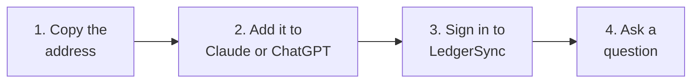

Chat with Claude or ChatGPT about your clients' bank accounts. It finds the answer in LedgerSync.



## 1. Copy this address

Click the copy icon on the right of the box.

```text
https://api.ledgersyncappv2.com/mcp
```

## 2. Add it to your AI

<Tabs>
  <Tab title="Claude">
    <Steps>
      <Step title="Click Customize, then Connectors">
        <Frame>
          
        </Frame>
      </Step>
      <Step title="Click Add, then Add custom connector">
        <Frame>
          
        </Frame>
      </Step>
      <Step title="Type LedgerSync, paste the address, click Continue">
        <Frame>
          
        </Frame>
      </Step>
      <Step title="Click Add">
        Do not change anything on this screen.

        <Frame>
          
        </Frame>
      </Step>
      <Step title="Click Connect">
        <Frame>
          
        </Frame>
      </Step>
      <Step title="Optional: let Claude read without asking each time">
        Next to **Read-only tools**, pick **Always allow**. Claude still asks before it changes anything.

        <Frame>
          
        </Frame>
      </Step>
    </Steps>
  </Tab>
  <Tab title="ChatGPT">
    <Steps>
      <Step title="Open chatgpt.com and click Plugins, then Add">
        <Frame>
          
        </Frame>
      </Step>
      <Step title="Click Create MCP App">
        <Frame>
          
        </Frame>
      </Step>
      <Step title="Type LedgerSync, paste the address, click Create">
        If it asks how to sign in, pick **OAuth**.
      </Step>
    </Steps>
  </Tab>
</Tabs>

## 3. Sign in to LedgerSync

Use the same email you use for LedgerSync.

<Frame>
  
</Frame>

Then click **Allow access**. You only see this the first time.

<Frame>
  
</Frame>

## 4. Ask

Open a **new chat** and ask, for example:

<CardGroup cols={2}>
  <Card title="Find a client" icon="magnifying-glass">
    "Find my client Acme."
  </Card>
  <Card title="Balances" icon="wallet">
    "Show Acme's bank balances."
  </Card>
  <Card title="Transactions" icon="list">
    "Show last month's transactions for Acme's checking account."
  </Card>
  <Card title="Statements" icon="file-pdf">
    "Get Acme's September bank statement."
  </Card>
  <Card title="Problems" icon="triangle-exclamation">
    "Which of my clients' banks are not working?"
  </Card>
  <Card title="Connect a bank" icon="link">
    "Send Acme a link to connect their bank."
  </Card>
</CardGroup>

<Note>
  **Nobody types a bank password in the chat.** When a bank needs a password, the AI gives you a link to a
  LedgerSync page. The password goes there.
</Note>

<Tip>
  Before the AI changes something, it asks you first. Say yes if it looks right.
</Tip>

## Something wrong?

| The AI says | Do this |
| --- | --- |
| You have no LedgerSync account, or it is under review | Sign up at [portal.ledgersyncappv2.com](https://portal.ledgersyncappv2.com), or wait for our email. |
| Finish the payment step | Finish it in the LedgerSync portal. |
| This app was disconnected | Remove LedgerSync from the AI and add it again. |
| Wait, or try again later | Wait a few minutes. Some limits reset the next day. |
| It cannot find the client | Ask "Find my client ..." first, then ask again. |
| It does not know LedgerSync | Start a new chat. |

**Already a LedgerSync customer?** Do not sign up again and do not pay. Email
[support@ledgersync.com](mailto:support@ledgersync.com).

Still stuck? Email [support@ledgersync.com](mailto:support@ledgersync.com).

## Turn it off

In the LedgerSync portal, open **Connected apps** and click **Disconnect**. Or remove LedgerSync from the AI.

## For developers

<AccordionGroup>
  <Accordion title="Try it with test banks (sandbox)">
    Add this address as a second connector, then connect **FinBank**, **MX Bank** or **Ledgersync Bank** with
    the test sign-ins in [Testing in sandbox](/guides/testing).

    ```text
    https://api-sandbox.ledgersyncappv2.com/mcp
    ```
  </Accordion>

  <Accordion title="Who can connect">
    - A LedgerSync developer account approved for that environment. Live also needs the payment step.
    - Existing LedgerSync app customers are linked by support, not charged again.
    - Only the account owner can connect. Teammates should ask the owner.
    - ChatGPT needs a paid plan (Plus or higher) and the web version. A Business, Enterprise or Education
      workspace can turn custom apps off; ask your workspace admin if **Create MCP App** is missing.
    - On Claude Team and Enterprise, an Owner first adds it under **Organization settings > Connectors**. The
      Claude Free plan allows one custom connector. Once added, it also works in Claude Desktop, the Claude
      mobile apps, and Claude Code signed in with the same account.
    - AI apps other than Claude and ChatGPT are blocked. Ask support if you need one.
  </Accordion>

  <Accordion title="What the AI can do (tools)">
    | Tool | What it does | Changes something |
    | --- | --- | --- |
    | `ledgersync_get_account_status` | Whether the connection is ready, sandbox or live, full or read-only, and how many of your account's refreshes are left today | No |
    | `ledgersync_find_clients` | Finds clients by name or email | No |
    | `ledgersync_create_client` | Adds a client (it checks for an existing one with the same name or email first) | Yes |
    | `ledgersync_create_connect_link` | Creates a secure page where the account holder picks their bank and signs in | Yes |
    | `ledgersync_search_institutions` | Checks whether a bank is supported, and whether it gives transactions and statements | No |
    | `ledgersync_list_connections` | Lists one client's bank connections, their status and when each last refreshed | No |
    | `ledgersync_get_connection` | Checks one bank connection | No |
    | `ledgersync_list_connections_needing_attention` | Lists the connections that are not working, across all your clients, the ones that need the account holder first | No |
    | `ledgersync_list_accounts` | Lists a client's bank accounts with balances | No |
    | `ledgersync_list_transactions` | Lists an account's transactions (the last 30 days unless you ask for other dates) | No |
    | `ledgersync_list_statements` | Lists an account's statements | No |
    | `ledgersync_get_statement_download_link` | Creates a link to download one statement PDF | No |
    | `ledgersync_refresh_connection` | Asks the bank for the latest balances and transactions | Yes |
    | `ledgersync_get_operation_status` | Reports whether a refresh has finished | No |
    | `ledgersync_get_fix_link` | Creates a secure page where the account holder signs in to their bank again to fix a broken connection | Yes |
  </Accordion>

  <Accordion title="Security">
    - Bank sign-ins only happen on LedgerSync pages. Connect links expire after 72 hours.
    - Statement download links expire after 10 minutes and work once; if a download fails, ask for a new link.
    - The connector cannot see or change API keys, webhooks or account settings.
    - Disconnecting in the portal's **Connected apps** page cuts the app off at once; adding it again signs in
      fresh.
  </Accordion>

  <Accordion title="Refreshes and limits">
    - LedgerSync refreshes every working connection about once a day. A refresh you ask for takes a few
      minutes; see [Keeping data fresh](/guides/data-freshness).
    - A connection refreshed in the last 30 minutes is skipped unless you ask for a new pull anyway.
    - Each connected AI app can start 20 refreshes a day on sandbox and 50 on live. They also count against
      your account's daily refresh budget, shared with API keys: 100 on sandbox, 500 on live.
    - Per connected AI app: 50 new clients a day, 30 connect links an hour, and 120 tool calls a minute on
      sandbox (60 on live).
    - Long lists of connections, accounts, transactions and statements come back in pages.
  </Accordion>

  <Accordion title="Error codes">
    Every error carries a `code`, the same as the API's (see [Errors](/guides/errors)). Access and rate-limit
    errors also carry a `next_step` sentence the AI reads out.

    | Code | What it means | What to do |
    | --- | --- | --- |
    | `access_not_active` | This sign-in has no active LedgerSync developer account yet: it never applied, or its first application is still under review. | Apply at [portal.ledgersyncappv2.com](https://portal.ledgersyncappv2.com), or wait for the review. Existing LedgerSync customers: email support, do not apply or pay. |
    | `access_request_not_approved` | Your application for this environment is still being reviewed, or needs more information. | Check its status in the portal. |
    | `billing_not_configured` | Live access is approved, but the payment step was not completed. | Complete the payment step in the portal. Existing LedgerSync customers: email support instead. |
    | `connector_app_pending_approval` | This AI app is not approved for LedgerSync. | Email support. |
    | `connector_access_revoked` | This AI app was disconnected from your LedgerSync account. | Remove the connector from the AI app and add it again. |
    | `insufficient_scope` | This connection is read-only, or lacks permission for what you asked. | Ask for something the connection may do, or email support. |
    | `rate_limit_exceeded` | A limit was reached. | Try again when the AI says you can, or tomorrow for a daily limit. |
    | `not_found` | No client, connection, account or statement matches, or it belongs to another account. | Ask the AI to find the client first, then try again. |
  </Accordion>
</AccordionGroup>
