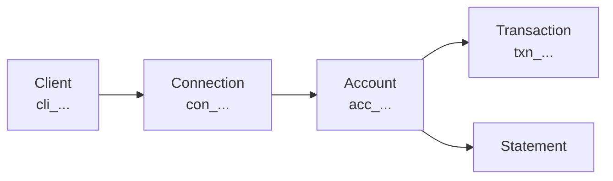

LedgerSync gives you **one API** for your users' bank data. You link an account once, and we return accounts, balances, transactions, and statements as clean JSON — no matter which bank or which underlying data source is behind it.

Under the hood we pull from three connectable sources and route between them for you:

<CardGroup cols={3}>
  <Card title="Finicity" icon="building-columns">
    Broadest US coverage, with bank OAuth where the institution supports it.
  </Card>
  <Card title="MX" icon="shuffle">
    An alternate aggregator that catches banks Finicity misses.
  </Card>
  <Card title="FDE" icon="file-lines">
    LedgerSync's proprietary credential-based extraction, for banks neither aggregator covers.
  </Card>
</CardGroup>

<Info>
  You never pick a source. When you initiate a connection, v3 chooses the right one **server-side** from our institution catalog. There is no `source` parameter — the id you get back (like `con_FINICITY_41294` or `con_MX_1224`) tells you which one answered.
</Info>

<Note>
  **A fourth, read-only source: `PDF`.** When a user's account was set up from **uploaded bank statements**, its accounts and transactions come back with `source: "PDF"` (ids like `acc_PDF_42`, `txn_PDF_8837`). You don't connect `PDF` through the widget, and it never appears under `GET /v3/connections` — a `PDF` account's `connection_id` is `null`. Statements aren't served for `PDF` accounts. Everything else (accounts, transactions, pagination) reads exactly like an aggregator source.
</Note>

## The data model

Everything hangs off four nested objects. Learn these once and the rest of the API reads naturally.



| Object | What it is |
| --- | --- |
| **Client** | Your record of one end-user. You set `external_id`; our id looks like `cli_01HXYZ...`. |
| **Connection** | One linked bank for a Client. A Client can have many. Aggregator sources only — uploaded-statement (`PDF`) data has no Connection. |
| **Account** | A checking, savings, card, or loan account. Exposed by a Connection, or — for uploaded-statement (`PDF`) data — directly under the Client with `connection_id: null`. |
| **Transaction / Statement** | The actual data on an Account. (Statements aren't served for `PDF` accounts.) |

<Tip>
  Reads are **Client-scoped** — pass `client_id` on every read call. For example: `GET /v3/accounts?client_id=cli_...&connection_id=con_FINICITY_41294`.
</Tip>

## How linking works, in one breath

<Steps>
  <Step title="Create a Client">
    Your end-user, keyed by your own `external_id`.
  </Step>
  <Step title="Initiate a Connection">
    `POST /v3/clients/{id}/connections` with an `institution_id`. You get a `202` and an `operation_id` to poll.
  </Step>
  <Step title="Hand off the widget">
    Open the returned `widget_url` in the user's browser. They pick their bank, sign in, and choose accounts. You never see their credentials.
  </Step>
  <Step title="Read the data">
    Once the connection goes `active`, store the canonical `con_...` id and read accounts, transactions, and statements.
  </Step>
</Steps>

The full walkthrough lives in [Connect a bank](/guides/connect-a-bank).

## Start here

<CardGroup cols={2}>
  <Card title="Quickstart" icon="rocket" href="/guides/quickstart">
    From a sandbox key to live transaction data in a few requests.
  </Card>
  <Card title="Connect a bank" icon="link" href="/guides/connect-a-bank">
    Initiate, hand off the widget, and read back accounts.
  </Card>
  <Card title="Webhooks" icon="webhook" href="/guides/webhooks">
    Get told the moment a connection goes active, fails, or refreshes.
  </Card>
  <Card title="Errors" icon="triangle-exclamation" href="/guides/errors">
    One error envelope, one field to branch on: `code`.
  </Card>
  <Card title="API Reference" icon="book" href="/api-reference">
    Every endpoint, field, and response, in full.
  </Card>
  <Card title="Authentication" icon="key" href="/authentication">
    Bearer keys, sandbox vs. live, and the trace header.
  </Card>
</CardGroup>

## Everything is JSON over HTTPS

No SDK required. Send and receive JSON, authenticate with a Bearer key, and read the `X-LS-Trace-Id` header on every response for support. Sandbox is one key away — grab an `sk_test_...` key, point at `https://api-sandbox.ledgersyncappv2.com/v3`, and link the built-in **FinBank** test bank with no MFA.

```bash Sandbox smoke test
curl https://api-sandbox.ledgersyncappv2.com/v3/institutions?q=chase \
  -H "Authorization: Bearer sk_test_..."
```

<Check>
  When you're ready to try a full link end to end, head to the [Quickstart](/guides/quickstart).
</Check>
